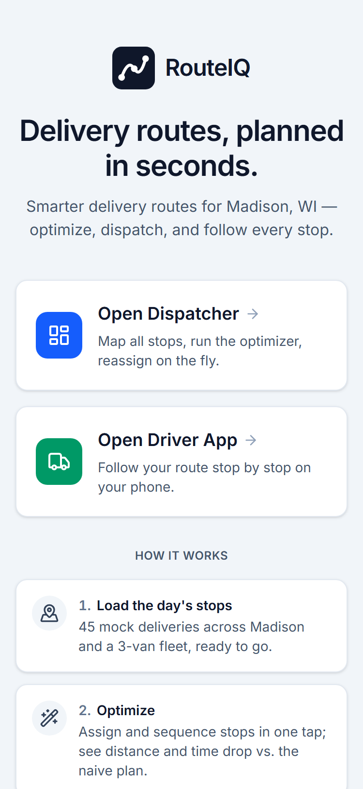
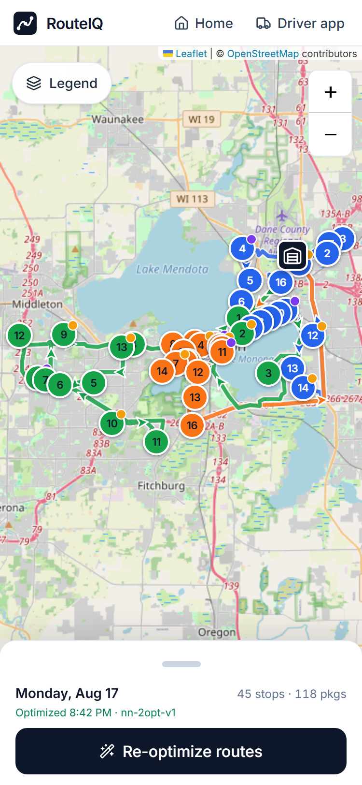
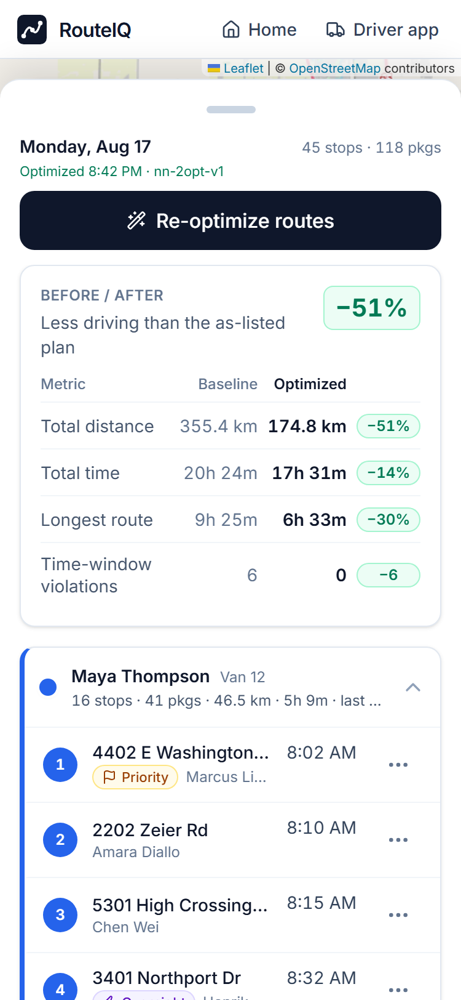
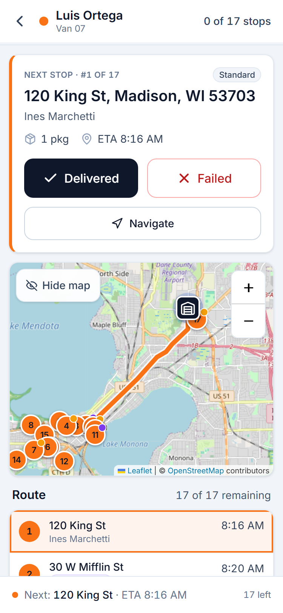
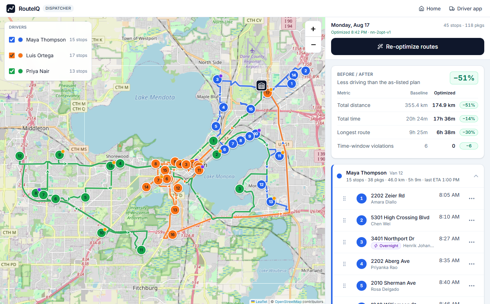

# RouteIQ — Delivery Route Optimizer Demo

Mobile-first web app that demonstrates delivery route optimization for a package operation in **Madison, Wisconsin**. A **dispatcher** sees every stop on a map, runs the optimizer, gets three driver routes with before/after metrics and can reassign stops by hand; a **driver** picks their name, follows their route stop-by-stop on a phone, records each delivery with proof (how it was left, who took it, an optional note and photo), skips or fails what they cannot deliver, and finishes with an end-of-day report.

The routing algorithm is a **swappable placeholder** (`nn-2opt-v1`: nearest-neighbour + 2-opt with time-window repair) behind a single API endpoint — the production algorithm drops into `POST /api/optimize` with zero UI changes. See [`docs/ALGORITHM_INTEGRATION.md`](docs/ALGORITHM_INTEGRATION.md).

- Zero paid APIs, **no API keys** — OpenStreetMap tiles via Leaflet.
- Deploys to **Vercel free tier** with `git push`.
- Mock data only: 45 stops, 3 drivers, 1 depot. No accounts, no database.

## Screenshots

Captured at 375×812 (2×) and 1366×850 by the smoke harness (`pnpm smoke`, see below); the files live in [`docs/screenshots/`](docs/screenshots/).

| Landing | Dispatcher — optimized map | Dispatcher — sheet with metrics | Driver — next stop |
| --- | --- | --- | --- |
|  |  |  |  |

| Dispatcher (desktop) |
| --- |
|  |

## Screens

| Route | What it is |
| --- | --- |
| `/` | Landing — pick **Dispatcher** or **Driver app** |
| `/dispatch` | Map of all stops + depot; **Optimize routes**; Before/After metrics; per-driver route cards; drag (desktop) or ⋯ menu (mobile) to move stops between drivers; legend; reset / export |
| `/driver` | Driver picker — stops, next ETA and progress per driver, **Continue** on the last-used one |
| `/driver/[id]` | Phone experience: progress header + activity log, **Next Stop** card with Delivered / Failed / Navigate / Skip for now, proof-of-delivery sheet (method, recipient, note, photo) with Undo, focused map of the current leg, ordered stop list, "Route complete" summary with a downloadable CSV/JSON report. Prepares its own route when nobody has optimized yet |
| `POST /api/optimize` | `OptimizeRequest → OptimizeResponse` (zod-validated: ≤ 1000 stops, ≤ 50 drivers, unique ids, sane numeric bounds, `400 { error, issues }` otherwise; the repair stage has a 1.5 s budget so any valid request returns in seconds) — **the algorithm seam** |
| `GET /api/seed` | `{ depot, drivers, stops }` mock data |
| `GET /api/health` | `{ ok, algorithm, version }` |

## Local development

Requirements: Node 20+ and pnpm 9+ (npm works too — replace `pnpm` with `npm run`).

```bash
pnpm install
pnpm dev          # http://localhost:3000
```

Other scripts:

```bash
pnpm verify       # typecheck + lint + test — the real gate; run before pushing
pnpm typecheck    # tsc --noEmit
pnpm lint         # eslint . --max-warnings=0 (Next 16 no longer lints inside `next build`)
pnpm test         # vitest: optimizer, store, /api routes, driver report/CSV, polyline decoder, time utilities
pnpm build        # production build — gates TypeScript (ESLint is gated by `pnpm lint`)
pnpm start        # serve the production build
pnpm preview      # build + start in one go — use this to judge speed (see below)
pnpm smoke [url]  # headless end-to-end smoke run against a running server (see below)
pnpm generate-icons     # regenerate public/icons/*.png (dependency-free)
pnpm generate-map-placeholder  # regenerate public/map-placeholder.{svg,webp} (needs a local Chrome/Edge for the WebP)
pnpm precompute-paths   # (optional, one-off) refresh src/data/paths.json from the OSRM demo server
```

**Judging load speed: use `pnpm preview`, not `pnpm dev`.** `next dev` ships unminified, unsplit JavaScript with the dev overlay and hot-reload machinery attached — 3.7–4.7 MB per page here, five to eight times what the production build sends, and it compiles each route the first time you open it. It will always feel slow, and none of that reflects what a visitor gets. `pnpm preview` (build + serve on <http://localhost:3000>) is the build that gets deployed; measure that.

The demo state (optimized routes, delivery progress and proof, the activity log, last driver) lives in `localStorage` under `routeiq-v1` and is kept in sync between open tabs on the same device (a driver's "Delivered" shows up in the dispatcher tab); use **Reset demo** in the dispatcher (or clear site data) to start over. A corrupt or blocked `localStorage` never blocks the app — it starts from defaults.

### End-to-end smoke run

`scripts/smoke-e2e.mjs` drives a local **Chrome or Edge** through the acceptance criteria with `puppeteer-core` (no browser download): 45 grey markers + depot within 2 s of navigation start, optimize → three routes with before/after metrics, reassign via the ⋯ menu, the driver flow at 375×812 (Delivered → proof sheet → confirm records the proof and a log event, Failed with a reason + note, "Skip for now" moves the stop to the end, the activity log, the end-of-day report on the route-complete card, progress survives a reload, no horizontal scroll), a driver arriving with nothing optimized (the route prepares itself), desktop dispatch with drag handles, legend / export / reset, the JSON API (`400` on invalid input, incl. schema bounds), real 404s, the double-tap guard, two-tab sync, done stops immovable, route complete, only own-origin + OSM-tile network hosts, and no console errors — 56 checks. It writes screenshots to `e2e-screens/` (git-ignored).

```bash
pnpm build && pnpm start          # in one terminal (port 3000)
pnpm smoke                        # in another; or: pnpm smoke http://localhost:3111
# CHROME_PATH=/path/to/chrome pnpm smoke   # if Chrome/Edge is not in a standard location
```

## Deploy to Vercel

1. Push this repo to GitHub/GitLab/Bitbucket.
2. In Vercel: **Add New → Project → Import** the repo. Framework preset **Next.js** is auto-detected; keep the defaults (build `next build`, install `pnpm install`). No environment variables are needed.
3. Deploy. Every `git push` to the production branch redeploys.

Or, from the CLI: `npx vercel` (accept the defaults) and `npx vercel --prod`.

One-click:

[](https://vercel.com/new/clone?repository-url=https%3A%2F%2Fgithub.com%2Felirc%2Flucasrouter&project-name=routeiq&repository-name=lucasrouter)

## Swapping in the real algorithm

Everything the UI needs is in the `OptimizeRequest → OptimizeResponse` contract (`src/lib/types.ts`). Two ways to plug in the production optimizer:

1. **TypeScript** — replace the body of `optimize()` in [`src/lib/optimizer/index.ts`](src/lib/optimizer/index.ts) and set `algorithm` to your version string.
2. **Python on Vercel** — add a Python serverless function (e.g. `api/optimize_py.py`) and have [`src/app/api/optimize/route.ts`](src/app/api/optimize/route.ts) proxy to it.

Full contract, JSON example, invariants and the Python skeleton: [`docs/ALGORITHM_INTEGRATION.md`](docs/ALGORITHM_INTEGRATION.md).

Manual reassignment in the dispatcher — and a driver's "Skip for now" — only re-runs `schedule()` (legs/ETAs/metrics), so both keep working with any algorithm, and they work before the first optimisation too (the first move bootstraps an empty plan). `/api/optimize` is called from exactly two places: the **Optimize** button on `/dispatch`, and `/driver/[id]`, which prepares a plan **automatically** when a driver opens their route and none exists yet (plus its "Prepare my route" button after a reset). **Reset demo** clears the plan without re-optimizing.

## Project structure

```
src/
  app/
    page.tsx                  landing
    dispatch/page.tsx         dispatcher
    driver/page.tsx           driver picker
    driver/[id]/page.tsx      driver route
    api/{optimize,seed,health}/route.ts
    layout.tsx, globals.css, manifest.ts, icon.svg, not-found.tsx, error.tsx
  components/
    map/        Leaflet MapView (dynamic, ssr:false), markers, polylines, legend
    ui/         Button, Card, BottomSheet, MetricsCompare, DriverCard, StopRow, badges, Toast…
    dispatch/   dispatcher panel, driver route lists (dnd-kit), move menus
    driver/     next-stop card, delivery-proof / fail-reason / activity-log sheets, stop list,
                route-complete card, report.ts (CSV + JSON), photo.ts (thumbnails)
  lib/
    types.ts                  domain model + API contract (incl. DeliveryProof / DeliveryEvent)
    optimizer/                index (optimize/baseline), distance, assign, sequence, repair, schedule, baseline
    time.ts, geo.ts, color.ts (WCAG-aware onColor/contrast), cn.ts, download.ts
  store/useAppStore.ts        zustand store, persisted to localStorage (routeiq-v1), tolerant storage + cross-tab sync
  data/                       depot.json, drivers.json, stops.json, paths.json (precomputed road polylines), index.ts, paths.ts
scripts/
  smoke-e2e.mjs               puppeteer-core end-to-end smoke run (`pnpm smoke`)
  precompute-paths.ts         one-off OSRM fetch → src/data/paths.json (never called at runtime)
  generate-icons.mjs          dependency-free PNG icon generator (any + maskable variants)
  generate-map-placeholder.mjs  map-shaped loading placeholder (SVG → 6 KB WebP via local Chrome)
tests/                        vitest (optimizer, store, api-optimize, driver-report, paths, time)
docs/
  ALGORITHM_INTEGRATION.md    contract, limits, example, Python skeleton
  screenshots/                the images above
public/                       sw.js, icons/ (icon-192/512, icon-maskable-192/512, apple-touch-icon)
DECISIONS.md                  every assumption made where the spec was silent
```

## How the placeholder optimizer works

1. Distance matrix over depot + stops using **estimated road km = haversine × 1.3**; drive time = road km / 32 km/h × 60. Every km the app reports (legs, routes, metrics) is that road estimate.
2. Assign stops to drivers with angle-seeded k-means, then rebalance for capacity and a ≤ 3 stop-count spread.
3. Sequence each route with nearest-neighbour + 2-opt.
4. Time-window repair: pull **late** stops earlier while violations decrease, and push **idle** waits to the tail — while a stop waits for its window to open, relocate single stops so the driver gets back to the depot earlier (or as early with everyone served earlier) without adding violations. Skipped when `respectTimeWindows: false`.
5. Schedule: legs, ETAs (waiting for a window to open is allowed and counted, arriving late is a violation), totals, metrics.
6. `baseline()` — round-robin in file order, unsequenced, same distance model — provides the "before" numbers.

On the seed data: **355 km → 175 km (−51 %)**, 20 h 24 m → 17 h 31 m of total route time (−14 %), longest route 9 h 25 m → 6 h 33 m, 6 → 0 time-window violations, in a few tens of milliseconds (~25–90 ms; the idle-repair pass is the cost).

## Performance & accessibility

Lighthouse 12 (mobile preset) against `pnpm preview` on the dev laptop that built this — a machine Lighthouse flags as slower than its 4× CPU throttle assumes (benchmark index ≈ 600–1100 against the ≈ 1500 it expects, and it drifts with whatever else the laptop is doing), so treat the numbers as a floor and the *deltas* as the signal. Both columns come from one interleaved A/B run per page: the same commit before and after the load-performance pass described in [`DECISIONS.md`](DECISIONS.md) (#52–57), servers running side by side so machine drift hits both.

| Page | Performance (before → after) | LCP | Total blocking time | JS bytes | A11y / BP / SEO |
| --- | --- | --- | --- | --- | --- |
| `/` | 90 → **93** | 2.84 s → 2.69 s | 235 → 215 ms | 619 → **588 KB** | 100 / 100 / 100 |
| `/driver` | 92 → **94** | 3.06 s → 2.75 s | 174 → **177 ms** | 619 → **588 KB** | 100 / 100 / 100 |
| `/driver/D1` | 83 → 71 | 3.63 s → 4.30 s | 300 → 521 ms | 829 → 895 KB | 100 / 100 / 100 |
| `/dispatch` | 52 → **64** | 6.21 s → **4.23 s** | 1238 → **818 ms** | 897 → **777 KB** | 96 / 96 / 100 |

The "after" column is a single run per page on the final integrated build (benchmark index ≈ 800–900, i.e. the machine is ~2× slower than Lighthouse's model, so read the scores as floors); the "before" column is from the interleaved A/B in `DECISIONS.md` #56. `/`'s speed index went 3.09 s → 0.91 s and its first contentful paint 1.40 s → 0.91 s (the stylesheet now ships in the HTML). `/driver/D1` is the one page that got slower — and it also grew a delivery-proof sheet, activity log and report in the same change set: it now prerenders (`generateStaticParams`), so its `<head>` carries the tile `preconnect` and the placeholder preload, and its skeleton contains the map placeholder image so it has a contentful paint before JavaScript runs; the remaining cost is the bigger driver bundle. Its blocking time (0.5 s) is well under the 0.6 s "good" threshold on this slow machine.

What keeps `/dispatch` fast: the Leaflet chunk is preloaded in parallel with hydration; road geometry and desktop drag & drop are only downloaded when they are actually used; the map is created directly on its final bounds; the 45 markers stream in as a low-priority transition after the tiles; a 6 KB map-shaped placeholder is in the server HTML (`fetchpriority=high`); no `Intl` calls or forced reflows on the boot path. Details and the honest caveats are in [`DECISIONS.md`](DECISIONS.md) (#42–44, #52–57). Installable as a PWA (manifest with `any` + `maskable` icons, service worker registered in production).

## Notes

- Map tiles come from `tile.openstreetmap.org` under the OSM tile usage policy (attribution included, default zoom levels).
- Road-shaped route lines are drawn from `src/data/paths.json`, precomputed once from the public OSRM demo server; the app itself never calls OSRM.
- PWA: `manifest.webmanifest` (with dedicated maskable icons) + a minimal service worker (installable; offline caching intentionally minimal).
