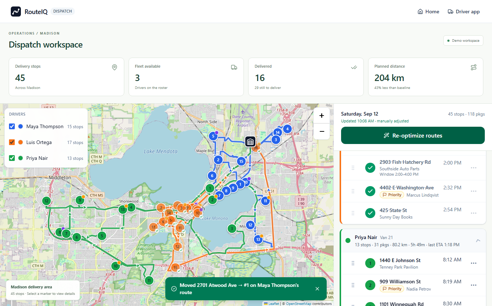
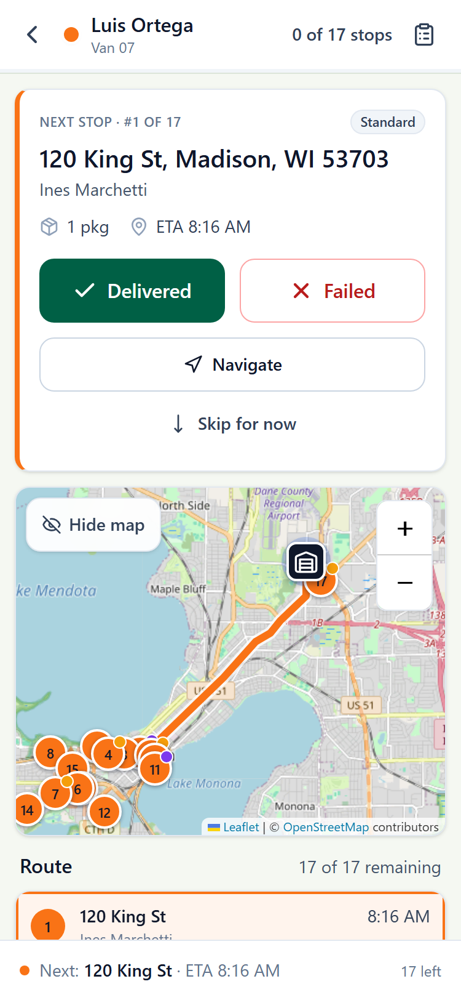

# RouteIQ delivery CRUD course

## How to use the repository

Open the source in this order: `src/lib/types.ts` defines the domain; `src/components/driver/DeliverySheet.tsx` collects user input; `src/store/useAppStore.ts` owns mutations and persistence; `src/lib/deliveryValidation.ts` is the new runtime boundary; `src/components/driver/report.ts` consumes events. The exact pre-change extract is preserved at [`docs/original/store-before-validation.md`](snapshots/useAppStore.ts.txt). It is deliberately noncompiling teaching material, because it shows the old trust boundary without becoming an accidental second implementation.

Keep a two-column notebook while reading. In the left column write “input and policy”; in the right write “state and consumer.” For a photo, format policy belongs to the validator, byte capacity belongs to the store, and display/export behavior belongs to the driver components. For a failure reason, vocabulary is a command precondition, so rejection must happen before the first setter. This division is the main junior-to-mid transition in the exercise: you learn to place logic by invariant and ownership rather than by whichever component is easiest to edit.

This course follows one small production change in RouteIQ: delivery proof now crosses a runtime validation boundary before it is written into the Zustand store and localStorage. The application is a Next.js App Router demo with dispatcher and driver screens. A driver can create a delivered or failed outcome, undo it, defer a pending stop, and export the resulting activity log. Those operations are CRUD-like state transitions even though the demo has no remote database. The key lesson is that TypeScript types describe code written by the team; they do not constrain JavaScript callers, stale browser state, malformed form payloads, or extensions.

Read the guides in order. First map the request path from a form to `recordDelivery` and persisted state. Then study the domain types and the new sanitizer. The worked change explains why validation belongs at the store boundary, where every caller benefits. The testing guide shows focused unit cases, typecheck, lint, and build checks. Practice asks you to extend the boundary without accidentally changing product behavior. Solutions and review prompts model the reasoning expected from a mid-level engineer. The trace lab makes you follow a malformed payload through the exact functions and observe which fields survive.

The examples use synthetic names and a tiny payload. They intentionally avoid pretending that localStorage is a secure database. RouteIQ still has last-writer-wins cross-tab behavior, browser storage quotas, and no authentication. The implementation trims names and notes, bounds them to practical limits, accepts known delivery methods, accepts image data URLs, and leaves the existing photo byte budget as the final guard. Unknown values are dropped or rejected rather than persisted. That gives the UI a stable state model while keeping the demo understandable.

Suggested pace: spend 20 minutes drawing the call graph, 25 minutes reading the implementation, 30 minutes completing the exercises, and 15 minutes running the checks. Keep the original stage copy available while experimenting so you can compare behavior rather than relying on memory.

## Verified application views

These screenshots come from the successful production smoke run, using isolated demo browser data. Follow the stop from the dispatch map to the driver action and then the proof/activity event discussed in the trace lab.

