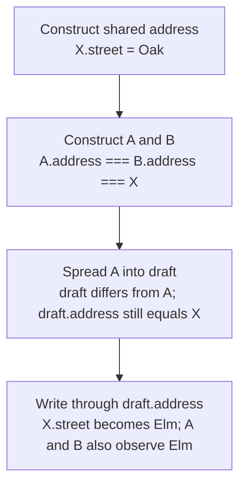

# Worked model: Two names, one nested object

This is a solved teaching model, followed by ways to practice it. It is not a report of a newly discovered bug in lucasrouter. Read the full explanation, follow the table, or reconstruct it aloud; switch methods when one exposes a gap that another hides.

## Start with a concrete situation

A shared address object has street="Oak". Records A and B both refer to it. We make draft={...A}, then assign draft.address.street="Elm".

Pause here and write a prediction in one sentence. A prediction is useful even when it is wrong because it gives the explanation something specific to correct. Do not change your original note after reading the result; add a correction beside it.

## Follow the state, one step at a time

| Step | Action or observation | State or consequence |
|---|---|---|
| 1 | Construct shared address | X.street = Oak |
| 2 | Construct A and B | A.address === B.address === X |
| 3 | Spread A into draft | draft differs from A; draft.address still equals X |
| 4 | Write through draft.address | X.street becomes Elm; A and B also observe Elm |

**Worked result:** All three paths observe Elm. A shallow outer copy did not isolate the nested object.

Read down the state column without the prose. Then read the prose without the table. The two representations should describe the same mechanism. If an arrow in your mental picture has no corresponding step, identify the assumption you supplied yourself.

## See the same trace as a diagram

Each arrow means the next reasoning step in this teaching trace. It is not automatically a network request, transaction, or object reference. Compare a node with its table row and explain the transition before moving downward.

## Why this result follows

The misleading part is that two statements are simultaneously true: draft is a new object, and the address is not a new object. Drawing boxes makes this easier to see. Draw three outer boxes and one address box. The arrows from A, B, and draft converge on the same address. Changing a property inside that last box is visible through every arrow that still points to it.

The focused repair is to decide which path the draft owns. For this example, construct a new outer object and a new address object before editing the street. The original address then remains Oak while the draft address becomes Elm. This preserves the intentional sharing between A and B while separating the editable draft. Copying every object in the application would be a much larger policy than the example requires.

A useful assertion checks both sides: the draft has the new value and B retains the old value. Checking only the draft would allow the broken implementation to pass. Also ask whether other nested objects remain shared intentionally. Immutability is a property of the operations and ownership contract, not a magic quality conferred by one spread operator.

This model explains JavaScript references. It does not prove how a store persists state or how a component subscribes to it. Those are later boundaries. A good learning note stops at the guarantee demonstrated by the object graph before discussing the actual application.

## The tempting explanation that fails

The wrong prediction is that changing draft can never affect A because draft !== A. That comparison says nothing about draft.address === A.address.

The mistake is useful because it is plausible. A weak exercise simply says the wrong answer is wrong. A stronger one identifies the exact point where it stops matching the fixture. Return to the table and mark that row. If your proposed repair changes a different row, explain why it reaches the same mechanism rather than merely hiding its visible symptom.

## A second worked case

**Change:** Now let A.address and B.address be two separate objects that both contain Oak. Does changing A affect B? Then make only draft share A.address.

**Resolution:** Equal-looking contents do not establish shared identity. B stays Oak when its address is a separate object. A and draft still move together until their shared address path is copied.

Compare the first and second cases by naming the changed assumption. Keep the other facts fixed while explaining the difference. This prevents a common learning trap: changing several things at once and crediting the result to whichever change seems most memorable.

## Connect the idea to this repository

The project involves a dispatcher or driver using the dispatch list and driver dialog. Compare this model with the local case **Two records share a nested address**: A practice fixture gives two stop records the same address object. Editing a draft street unexpectedly changes the other record. Trace aliasing instead of treating every copied object as independent.

The project-specific rule in that case is: An intended edit must not mutate unrelated records through shared references.

The connection is an opportunity to compare boundaries, not permission to paste the toy algorithm into application code. Start at the [source map](../README.md). Locate the current caller, representation, validation, and state owner. If the concept is only indirectly relevant, explain the difference; for example, a local projection and a durable transaction may share a reasoning pattern without sharing an implementation.

## Practice by reading, drawing, building, and speaking

For a reading pass, explain one paragraph in your own words and attach it to a row of the trace. For a drawing pass, use boxes for values or owners and arrows for references or events; label what each arrow means so references are not confused with requests. For a building pass, construct the smallest fixture that distinguishes the correct result from the tempting shortcut. Keep it in practice files, not production code.

For a speaking pass, explain the setup and result in ninety seconds without naming a library. Then add the implementation detail that matters. If that detail cannot be connected to an observable consequence, it may not belong in the first explanation. A listener should be able to change one input and understand why your prediction changes or stays the same.

## A short journal entry to keep

Write four connected sentences: I initially predicted __ because __. The worked trace shows __ at step __. My revised rule is __, under assumptions __. I still need __ evidence before claiming __ about the application.

The last sentence matters. Understanding a pure model is useful progress, but it does not automatically verify browser interaction, database isolation, current production behavior, or another person's learning. Return tomorrow with a different fixture and see whether you can reconstruct the mechanism without rereading this page.
