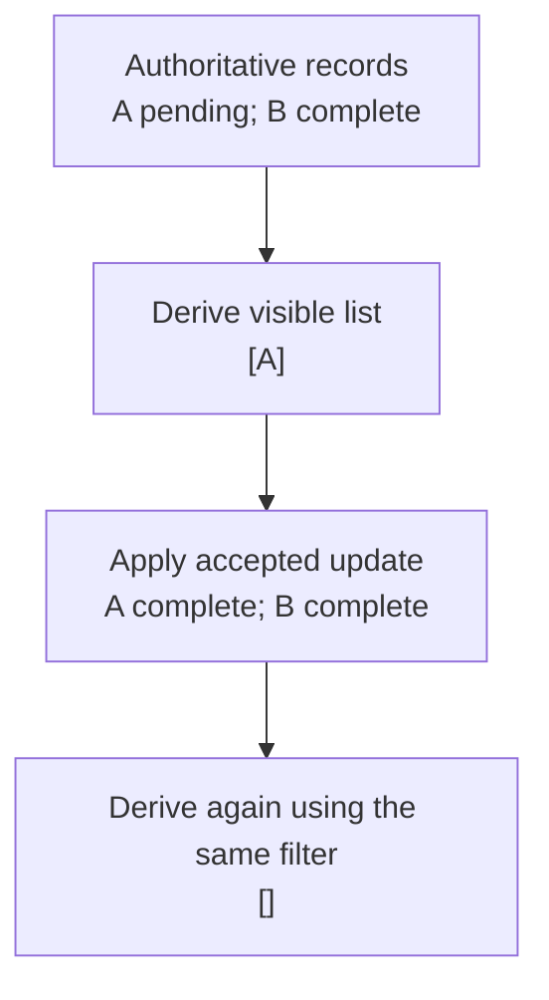

# Worked model: A filtered view is not a second database

This is a solved teaching model, followed by ways to practice it. It is not a report of a newly discovered bug in lucasrouter. Read the full explanation, follow the table, or reconstruct it aloud; switch methods when one exposes a gap that another hides.

## Start with a concrete situation

Records are A pending and B complete. The current filter is pending. An accepted update changes A to complete.

Pause here and write a prediction in one sentence. A prediction is useful even when it is wrong because it gives the explanation something specific to correct. Do not change your original note after reading the result; add a correction beside it.

## Follow the state, one step at a time

| Step | Action or observation | State or consequence |
|---|---|---|
| 1 | Authoritative records | A pending; B complete |
| 2 | Derive visible list | [A] |
| 3 | Apply accepted update | A complete; B complete |
| 4 | Derive again using the same filter | [] |

**Worked result:** The pending list becomes empty. The stored records still contain both A and B.

Read down the state column without the prose. Then read the prose without the table. The two representations should describe the same mechanism. If an arrow in your mental picture has no corresponding step, identify the assumption you supplied yourself.

## See the same trace as a diagram

Each arrow means the next reasoning step in this teaching trace. It is not automatically a network request, transaction, or object reference. Compare a node with its table row and explain the transition before moving downward.

## Why this result follows

The empty screen can look like lost data until we separate storage from projection. A filter answers which records satisfy a predicate now. It does not own the records and does not need to preserve a copy of an item that no longer satisfies the predicate. The result becoming empty is the correct consequence of the accepted update in this example.

If a component stores records and visibleRecords independently, every relevant change must keep the two copies consistent. A missed update can leave A visible even though its status is complete. Recomputing a small derived view from records and filter removes that additional synchronization obligation. If the calculation is expensive, measure it before adding a performance strategy; the data ownership rule remains the same.

Selection adds a separate product decision. If selectedId is A, the application may keep a detail view with a clear indication that it falls outside the filter, or it may close the detail view. Neither choice is implied by the filter function. Accidentally selecting whichever item occupies A's old array position is a different and usually unwanted behavior.

The important test therefore has more than one assertion. The pending view is empty, the authoritative collection still has two records, and the selection behavior matches its stated rule. This makes the difference between projection, storage, and interaction visible instead of calling every unexpected empty list a fetching bug.

## The tempting explanation that fails

Keeping A in the pending list merely to avoid an empty screen contradicts the filter contract. Deleting A from storage merely because it is no longer visible confuses projection with ownership.

The mistake is useful because it is plausible. A weak exercise simply says the wrong answer is wrong. A stronger one identifies the exact point where it stops matching the fixture. Return to the table and mark that row. If your proposed repair changes a different row, explain why it reaches the same mechanism rather than merely hiding its visible symptom.

## A second worked case

**Change:** Change the filter to all after A completes. Then ask whether an empty pending list should display loading or a completed empty state.

**Resolution:** The all view contains A and B with their current statuses. A successful filter returning no rows is an empty result, not evidence that a request is still pending.

Compare the first and second cases by naming the changed assumption. Keep the other facts fixed while explaining the difference. This prevents a common learning trap: changing several things at once and crediting the result to whichever change seems most memorable.

## Connect the idea to this repository

The project involves a dispatcher or driver using the dispatch list and driver dialog. Compare this model with the local case **A list changes underneath a selection**: A dispatcher filters the list while a driver updates one stop. The selected row disappears from the visible list. The UI must keep entity identity distinct from its displayed position.

The project-specific rule in that case is: Selection refers to a stable stop ID; visibility is a separate fact.

The connection is an opportunity to compare boundaries, not permission to paste the toy algorithm into application code. Start at the [source map](../README.md). Locate the current caller, representation, validation, and state owner. If the concept is only indirectly relevant, explain the difference; for example, a local projection and a durable transaction may share a reasoning pattern without sharing an implementation.

## Practice by reading, drawing, building, and speaking

For a reading pass, explain one paragraph in your own words and attach it to a row of the trace. For a drawing pass, use boxes for values or owners and arrows for references or events; label what each arrow means so references are not confused with requests. For a building pass, construct the smallest fixture that distinguishes the correct result from the tempting shortcut. Keep it in practice files, not production code.

For a speaking pass, explain the setup and result in ninety seconds without naming a library. Then add the implementation detail that matters. If that detail cannot be connected to an observable consequence, it may not belong in the first explanation. A listener should be able to change one input and understand why your prediction changes or stays the same.

## A short journal entry to keep

Write four connected sentences: I initially predicted __ because __. The worked trace shows __ at step __. My revised rule is __, under assumptions __. I still need __ evidence before claiming __ about the application.

The last sentence matters. Understanding a pure model is useful progress, but it does not automatically verify browser interaction, database isolation, current production behavior, or another person's learning. Return tomorrow with a different fixture and see whether you can reconstruct the mechanism without rereading this page.
