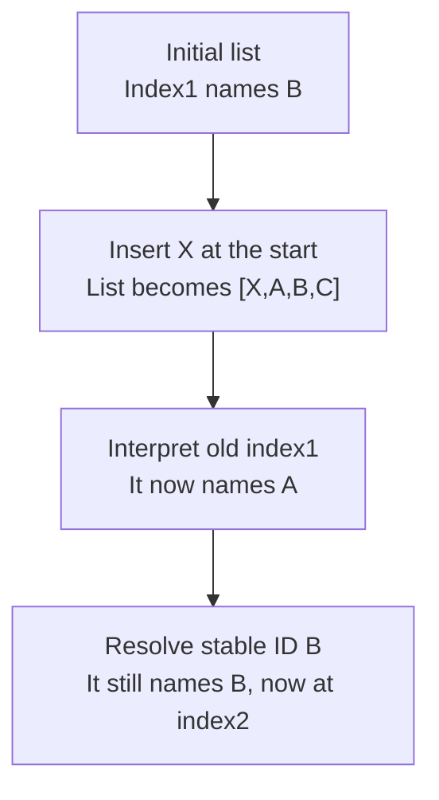

# Worked model: Position changes while identity stays put

This is a solved teaching model, followed by ways to practice it. It is not a report of a newly discovered bug in lucasrouter. Read the full explanation, follow the table, or reconstruct it aloud; switch methods when one exposes a gap that another hides.

## Start with a concrete situation

The list is [A,B,C], and the user selects B. Another update inserts X at the beginning. Compare storing selectedIndex=1 with selectedId=B.

Pause here and write a prediction in one sentence. A prediction is useful even when it is wrong because it gives the explanation something specific to correct. Do not change your original note after reading the result; add a correction beside it.

## Follow the state, one step at a time

| Step | Action or observation | State or consequence |
|---|---|---|
| 1 | Initial list | Index1 names B |
| 2 | Insert X at the start | List becomes [X,A,B,C] |
| 3 | Interpret old index1 | It now names A |
| 4 | Resolve stable ID B | It still names B, now at index2 |

**Worked result:** A retained position selects the wrong record; a retained stable ID identifies the intended record.

Read down the state column without the prose. Then read the prose without the table. The two representations should describe the same mechanism. If an arrow in your mental picture has no corresponding step, identify the assumption you supplied yourself.

## See the same trace as a diagram

Each arrow means the next reasoning step in this teaching trace. It is not automatically a network request, transaction, or object reference. Compare a node with its table row and explain the transition before moving downward.

## Why this result follows

An index is a perfectly useful answer to where an item is in one particular array. It is not automatically an answer to which domain entity the user chose. The insertion changes positions without changing the identities of A, B, and C. Once that distinction is drawn, the defect no longer looks like an unpredictable rendering problem.

Use the same reasoning when a row owns an input draft or expanded state. If component identity follows position while domain identity follows a record ID, a reorder can attach remembered interaction state to another record. The correct key depends on the intended identity. A static list that never reorders has different constraints from a searchable list with insertion and deletion.

Selection lookup can return no record when the selected entity has been removed. That is an outcome to design, not a reason to fall back to an unrelated index. A nullable selection, closed detail view, or explicit unavailable state can all be coherent if chosen deliberately. The lookup and the UI response should make the absence visible.

The regression fixture should include at least two existing records and a change that moves them. A single-row happy path cannot expose identity switching. Assert the selected record's ID and the draft associated with it, rather than only asserting that some row is selected.

## The tempting explanation that fails

Using an array position as a durable entity ID makes a reorder look like an edit to the selected record.

The mistake is useful because it is plausible. A weak exercise simply says the wrong answer is wrong. A stronger one identifies the exact point where it stops matching the fixture. Return to the table and mark that row. If your proposed repair changes a different row, explain why it reaches the same mechanism rather than merely hiding its visible symptom.

## A second worked case

**Change:** Remove B after inserting X. Keep selectedId=B and describe the lookup result. Do not substitute the item now occupying index2.

**Resolution:** The lookup finds no B. The interaction should follow the declared missing-selection policy; selecting another entity requires an explicit decision.

Compare the first and second cases by naming the changed assumption. Keep the other facts fixed while explaining the difference. This prevents a common learning trap: changing several things at once and crediting the result to whichever change seems most memorable.

## Connect the idea to this repository

The project involves a dispatcher or driver using the dispatch list and driver dialog. Compare this model with the local case **A list changes underneath a selection**: A dispatcher filters the list while a driver updates one stop. The selected row disappears from the visible list. The UI must keep entity identity distinct from its displayed position.

The project-specific rule in that case is: Selection refers to a stable stop ID; visibility is a separate fact.

The connection is an opportunity to compare boundaries, not permission to paste the toy algorithm into application code. Start at the [source map](../README.md). Locate the current caller, representation, validation, and state owner. If the concept is only indirectly relevant, explain the difference; for example, a local projection and a durable transaction may share a reasoning pattern without sharing an implementation.

## Practice by reading, drawing, building, and speaking

For a reading pass, explain one paragraph in your own words and attach it to a row of the trace. For a drawing pass, use boxes for values or owners and arrows for references or events; label what each arrow means so references are not confused with requests. For a building pass, construct the smallest fixture that distinguishes the correct result from the tempting shortcut. Keep it in practice files, not production code.

For a speaking pass, explain the setup and result in ninety seconds without naming a library. Then add the implementation detail that matters. If that detail cannot be connected to an observable consequence, it may not belong in the first explanation. A listener should be able to change one input and understand why your prediction changes or stays the same.

## A short journal entry to keep

Write four connected sentences: I initially predicted __ because __. The worked trace shows __ at step __. My revised rule is __, under assumptions __. I still need __ evidence before claiming __ about the application.

The last sentence matters. Understanding a pure model is useful progress, but it does not automatically verify browser interaction, database isolation, current production behavior, or another person's learning. Return tomorrow with a different fixture and see whether you can reconstruct the mechanism without rereading this page.
