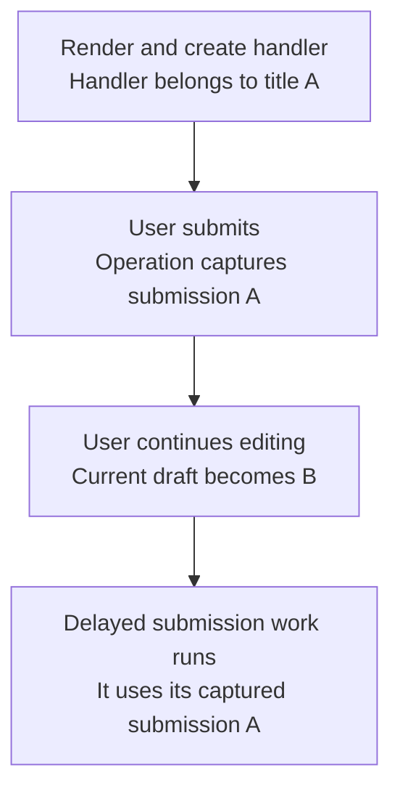

# Worked model: Which value does the delayed work belong to?

This is a solved teaching model, followed by ways to practice it. It is not a report of a newly discovered bug in lucasrouter. Read the full explanation, follow the table, or reconstruct it aloud; switch methods when one exposes a gap that another hides.

## Start with a concrete situation

A submission handler is created for a render whose title is A. It schedules work using that submission value. Before the work runs, the visible draft becomes B.

Pause here and write a prediction in one sentence. A prediction is useful even when it is wrong because it gives the explanation something specific to correct. Do not change your original note after reading the result; add a correction beside it.

## Follow the state, one step at a time

| Step | Action or observation | State or consequence |
|---|---|---|
| 1 | Render and create handler | Handler belongs to title A |
| 2 | User submits | Operation captures submission A |
| 3 | User continues editing | Current draft becomes B |
| 4 | Delayed submission work runs | It uses its captured submission A |

**Worked result:** A can be correct for an explicit submission snapshot, even though B is now visible in the draft.

Read down the state column without the prose. Then read the prose without the table. The two representations should describe the same mechanism. If an arrow in your mental picture has no corresponding step, identify the assumption you supplied yourself.

## See the same trace as a diagram

Each arrow means the next reasoning step in this teaching trace. It is not automatically a network request, transaction, or object reference. Compare a node with its table row and explain the transition before moving downward.

## Why this result follows

The first task is not to choose a hook. It is to decide what the operation represents. If the user pressed Save on title A, the operation may correctly represent that particular submission. Reading B later could silently change what was submitted. If the feature is instead an autosave of the latest draft, preserving A forever may be wrong. The same timing behavior has different meaning under different contracts.

A timeline prevents vague claims about stale closures. Label the render that creates the handler, the event that starts the operation, the later edit, and the moment a value is read. Then identify the binding or object the callback actually uses. A mutable reference can supply a different reading policy, but the reference does not decide which policy the product wants.

Result application is another ownership decision. A successful save of A should not necessarily replace the newer unsaved draft B with A. The application can acknowledge the saved submission while preserving the user's newer edits. That requires separating submitted data, current draft, and saved baseline rather than treating them as one interchangeable object.

The most useful test asserts both the payload sent and the draft left visible after completion. An assertion that the request succeeded misses the interaction consequence. The example does not claim that every closure freezes all mutable state; it asks which value this particular operation intentionally owns.

## The tempting explanation that fails

Always read the newest value is not a complete fix: it can change the meaning of an earlier explicit submission.

The mistake is useful because it is plausible. A weak exercise simply says the wrong answer is wrong. A stronger one identifies the exact point where it stops matching the fixture. Return to the table and mark that row. If your proposed repair changes a different row, explain why it reaches the same mechanism rather than merely hiding its visible symptom.

## A second worked case

**Change:** The user submits A, types B, and then the A save completes. Under a preserve-newer-draft policy, what is acknowledged and what remains editable?

**Resolution:** A becomes the acknowledged submitted version, while B remains the current draft. A later save can create a new operation for B.

Compare the first and second cases by naming the changed assumption. Keep the other facts fixed while explaining the difference. This prevents a common learning trap: changing several things at once and crediting the result to whichever change seems most memorable.

## Connect the idea to this repository

The project involves a dispatcher or driver using the dispatch list and driver dialog. Compare this model with the local case **Undo arrives after newer work**: A stop is marked delivered, later marked failed, and then an older undo action arrives. This interview uses a synthetic revision contract, not an assertion that the current store has revisions.

The project-specific rule in that case is: An old undo must not overwrite a newer accepted change.

The connection is an opportunity to compare boundaries, not permission to paste the toy algorithm into application code. Start at the [source map](../README.md). Locate the current caller, representation, validation, and state owner. If the concept is only indirectly relevant, explain the difference; for example, a local projection and a durable transaction may share a reasoning pattern without sharing an implementation.

## Practice by reading, drawing, building, and speaking

For a reading pass, explain one paragraph in your own words and attach it to a row of the trace. For a drawing pass, use boxes for values or owners and arrows for references or events; label what each arrow means so references are not confused with requests. For a building pass, construct the smallest fixture that distinguishes the correct result from the tempting shortcut. Keep it in practice files, not production code.

For a speaking pass, explain the setup and result in ninety seconds without naming a library. Then add the implementation detail that matters. If that detail cannot be connected to an observable consequence, it may not belong in the first explanation. A listener should be able to change one input and understand why your prediction changes or stays the same.

## A short journal entry to keep

Write four connected sentences: I initially predicted __ because __. The worked trace shows __ at step __. My revised rule is __, under assumptions __. I still need __ evidence before claiming __ about the application.

The last sentence matters. Understanding a pure model is useful progress, but it does not automatically verify browser interaction, database isolation, current production behavior, or another person's learning. Return tomorrow with a different fixture and see whether you can reconstruct the mechanism without rereading this page.
