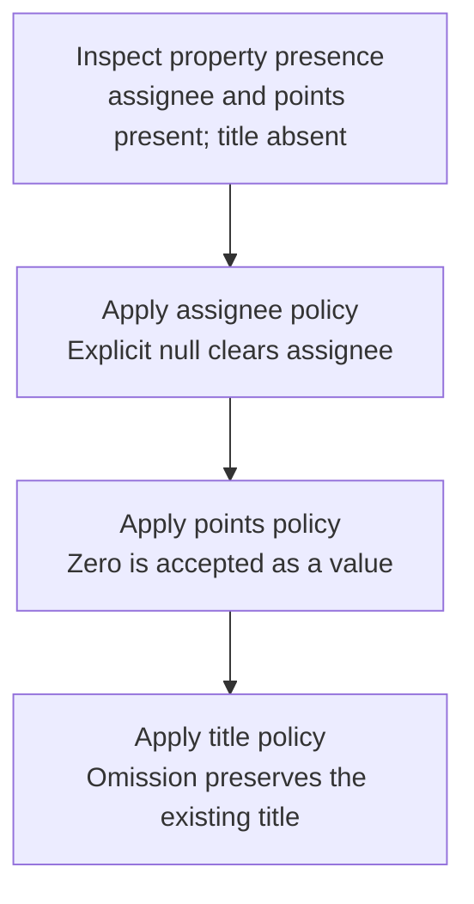

# Worked model: Three values that truthiness collapses

This is a solved teaching model, followed by ways to practice it. It is not a report of a newly discovered bug in lucasrouter. Read the full explanation, follow the table, or reconstruct it aloud; switch methods when one exposes a gap that another hides.

## Start with a concrete situation

An issue has assignee=U1 and points=3. The patch is {assignee:null,points:0}; title is absent.

Pause here and write a prediction in one sentence. A prediction is useful even when it is wrong because it gives the explanation something specific to correct. Do not change your original note after reading the result; add a correction beside it.

## Follow the state, one step at a time

| Step | Action or observation | State or consequence |
|---|---|---|
| 1 | Inspect property presence | assignee and points present; title absent |
| 2 | Apply assignee policy | Explicit null clears assignee |
| 3 | Apply points policy | Zero is accepted as a value |
| 4 | Apply title policy | Omission preserves the existing title |

**Worked result:** The result has no assignee, zero points, and the old title.

Read down the state column without the prose. Then read the prose without the table. The two representations should describe the same mechanism. If an arrow in your mental picture has no corresponding step, identify the assumption you supplied yourself.

## See the same trace as a diagram

Each arrow means the next reasoning step in this teaching trace. It is not automatically a network request, transaction, or object reference. Compare a node with its table row and explain the transition before moving downward.

## Why this result follows

A defaulting expression can be syntactically concise while changing the public contract. If a patch uses value || oldValue, zero and null both select oldValue. That loses two intentional operations in this example. The mistake is not that short expressions are inherently bad; it is that truthiness answers a different question from whether a property was supplied.

Write a small decision table for each field before implementation. For assignee, absence preserves and null clears. For points, absence preserves and zero is a valid supplied value. For a title, an empty string might be rejected rather than interpreted as preserve. Those choices belong to the endpoint's contract, not a universal normalization rule.

Unknown or forbidden keys need their own policy. A generic object spread can accidentally allow a caller to set a tenant identifier, revision, or server-owned status. Constructing the accepted public shape makes this boundary visible. Whether unknown keys are rejected or stripped should be stated and tested rather than left to a helper's incidental behavior.

A useful worked example includes the old record, the exact patch, and the complete result. That lets the reader see preserved values as well as changes. Checking only points would not reveal that an unrelated field was erased or that an omitted title became undefined.

## The tempting explanation that fails

Treating every falsy value as omission loses legitimate zero values and explicit clearing operations.

The mistake is useful because it is plausible. A weak exercise simply says the wrong answer is wrong. A stronger one identifies the exact point where it stops matching the fixture. Return to the table and mark that row. If your proposed repair changes a different row, explain why it reaches the same mechanism rather than merely hiding its visible symptom.

## A second worked case

**Change:** Try three separate patches: {}, {points:0}, and {points:null}. Keep the endpoint rule that points permits an integer or null.

**Resolution:** The empty patch preserves 3, the zero patch sets 0, and the null patch clears the value. These are three distinguishable outcomes.

Compare the first and second cases by naming the changed assumption. Keep the other facts fixed while explaining the difference. This prevents a common learning trap: changing several things at once and crediting the result to whichever change seems most memorable.

## Connect the idea to this repository

The project involves a dispatcher or driver using the dispatch list and driver dialog. Compare this model with the local case **A restored draft has yesterday’s shape**: A local draft saved by an older version lacks a newly introduced optional note field. A startup cast hides the missing value until a control reads it.

The project-specific rule in that case is: Serialized input needs an explicit compatibility rule at restoration.

The connection is an opportunity to compare boundaries, not permission to paste the toy algorithm into application code. Start at the [source map](../README.md). Locate the current caller, representation, validation, and state owner. If the concept is only indirectly relevant, explain the difference; for example, a local projection and a durable transaction may share a reasoning pattern without sharing an implementation.

## Practice by reading, drawing, building, and speaking

For a reading pass, explain one paragraph in your own words and attach it to a row of the trace. For a drawing pass, use boxes for values or owners and arrows for references or events; label what each arrow means so references are not confused with requests. For a building pass, construct the smallest fixture that distinguishes the correct result from the tempting shortcut. Keep it in practice files, not production code.

For a speaking pass, explain the setup and result in ninety seconds without naming a library. Then add the implementation detail that matters. If that detail cannot be connected to an observable consequence, it may not belong in the first explanation. A listener should be able to change one input and understand why your prediction changes or stays the same.

## A short journal entry to keep

Write four connected sentences: I initially predicted __ because __. The worked trace shows __ at step __. My revised rule is __, under assumptions __. I still need __ evidence before claiming __ about the application.

The last sentence matters. Understanding a pure model is useful progress, but it does not automatically verify browser interaction, database isolation, current production behavior, or another person's learning. Return tomorrow with a different fixture and see whether you can reconstruct the mechanism without rereading this page.
