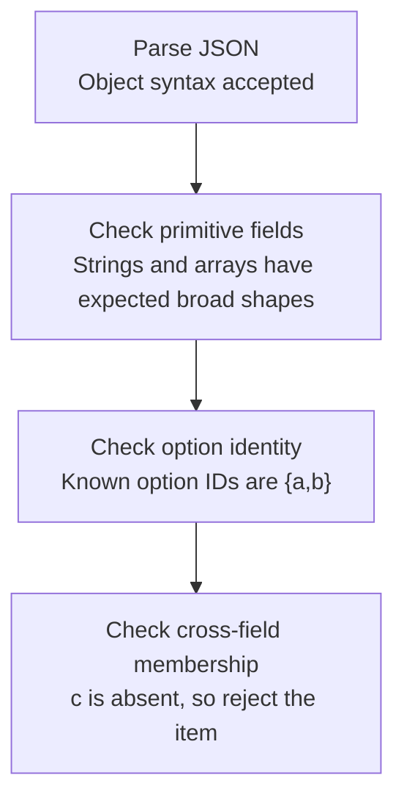

# Worked model: Valid JSON with an invalid relationship

This is a solved teaching model, followed by ways to practice it. It is not a report of a newly discovered bug in lucasrouter. Read the full explanation, follow the table, or reconstruct it aloud; switch methods when one exposes a gap that another hides.

## Start with a concrete situation

A generated question has options with IDs a and b, but correctOptionId is c. Its JSON syntax and primitive field types are valid.

Pause here and write a prediction in one sentence. A prediction is useful even when it is wrong because it gives the explanation something specific to correct. Do not change your original note after reading the result; add a correction beside it.

## Follow the state, one step at a time

| Step | Action or observation | State or consequence |
|---|---|---|
| 1 | Parse JSON | Object syntax accepted |
| 2 | Check primitive fields | Strings and arrays have expected broad shapes |
| 3 | Check option identity | Known option IDs are {a,b} |
| 4 | Check cross-field membership | c is absent, so reject the item |

**Worked result:** The payload fails semantic validation even though parsing succeeded.

Read down the state column without the prose. Then read the prose without the table. The two representations should describe the same mechanism. If an arrow in your mental picture has no corresponding step, identify the assumption you supplied yourself.

## See the same trace as a diagram

Each arrow means the next reasoning step in this teaching trace. It is not automatically a network request, transaction, or object reference. Compare a node with its table row and explain the transition before moving downward.

## Why this result follows

Parsing and validation answer different questions. Parsing tells us that the bytes form a value in the data format. Primitive checks tell us something about individual fields. A relationship such as correctOptionId must identify a supplied option requires comparing fields. Neither a parser nor an unchecked type assertion performs that comparison for us.

The validation order matters when normalization changes identity. Suppose the option IDs are "a" and " a ", and the contract trims identifiers. They are distinct raw strings but the same normalized ID. Checking uniqueness before trimming can accept a payload whose downstream representation is ambiguous. Normalize according to the contract, then validate the relationships that consumers will use.

Passing structural and relational checks is still not the same as being factually correct. A question can name an existing option as correct while making a false claim. It can cite an allowed source that does not support its answer. Keep schema validity, authorization, grounding support, and quality evaluation as separate statements so one green check is not used to imply all four.

The compact teaching fixture is valuable because it isolates one relationship. A huge generated response can bury the mechanism in irrelevant text. After the small example is understood, the application adapter needs tests for malformed input and for the actual shared schema it promises to callers.

## The tempting explanation that fails

Casting a parsed object to the desired type does not verify that c belongs to the options.

The mistake is useful because it is plausible. A weak exercise simply says the wrong answer is wrong. A stronger one identifies the exact point where it stops matching the fixture. Return to the table and mark that row. If your proposed repair changes a different row, explain why it reaches the same mechanism rather than merely hiding its visible symptom.

## A second worked case

**Change:** Change correctOptionId to a, but keep a source ID outside the authorized set. Does fixing the option relationship make the entire payload acceptable?

**Resolution:** No. The option relationship now passes, but source membership still fails. Independent boundaries need independent decisions.

Compare the first and second cases by naming the changed assumption. Keep the other facts fixed while explaining the difference. This prevents a common learning trap: changing several things at once and crediting the result to whichever change seems most memorable.

## Connect the idea to this repository

The project involves a dispatcher or driver using the dispatch list and driver dialog. Compare this model with the local case **Proof and status disagree**: A report says a stop is delivered while its required proof field is absent. The candidate must distinguish UI form validation from the domain transition and historical-data policy.

The project-specific rule in that case is: A transition must satisfy the chosen status-and-proof contract at its authority boundary.

The connection is an opportunity to compare boundaries, not permission to paste the toy algorithm into application code. Start at the [source map](../README.md). Locate the current caller, representation, validation, and state owner. If the concept is only indirectly relevant, explain the difference; for example, a local projection and a durable transaction may share a reasoning pattern without sharing an implementation.

## Practice by reading, drawing, building, and speaking

For a reading pass, explain one paragraph in your own words and attach it to a row of the trace. For a drawing pass, use boxes for values or owners and arrows for references or events; label what each arrow means so references are not confused with requests. For a building pass, construct the smallest fixture that distinguishes the correct result from the tempting shortcut. Keep it in practice files, not production code.

For a speaking pass, explain the setup and result in ninety seconds without naming a library. Then add the implementation detail that matters. If that detail cannot be connected to an observable consequence, it may not belong in the first explanation. A listener should be able to change one input and understand why your prediction changes or stays the same.

## A short journal entry to keep

Write four connected sentences: I initially predicted __ because __. The worked trace shows __ at step __. My revised rule is __, under assumptions __. I still need __ evidence before claiming __ about the application.

The last sentence matters. Understanding a pure model is useful progress, but it does not automatically verify browser interaction, database isolation, current production behavior, or another person's learning. Return tomorrow with a different fixture and see whether you can reconstruct the mechanism without rereading this page.
