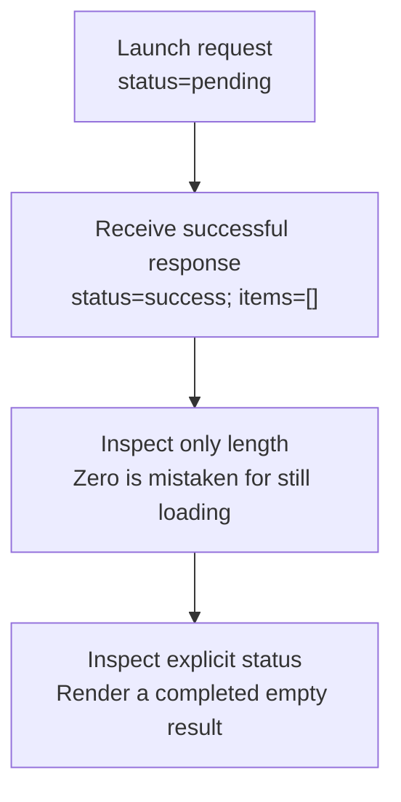

# Worked model: An empty success is not unfinished work

This is a solved teaching model, followed by ways to practice it. It is not a report of a newly discovered bug in lucasrouter. Read the full explanation, follow the table, or reconstruct it aloud; switch methods when one exposes a gap that another hides.

## Start with a concrete situation

A query has completed successfully with items=[]. The view currently checks items.length===0 to decide whether to show a spinner.

Pause here and write a prediction in one sentence. A prediction is useful even when it is wrong because it gives the explanation something specific to correct. Do not change your original note after reading the result; add a correction beside it.

## Follow the state, one step at a time

| Step | Action or observation | State or consequence |
|---|---|---|
| 1 | Launch request | status=pending |
| 2 | Receive successful response | status=success; items=[] |
| 3 | Inspect only length | Zero is mistaken for still loading |
| 4 | Inspect explicit status | Render a completed empty result |

**Worked result:** The correct display is an empty-success state, not a perpetual spinner.

Read down the state column without the prose. Then read the prose without the table. The two representations should describe the same mechanism. If an arrow in your mental picture has no corresponding step, identify the assumption you supplied yourself.

## See the same trace as a diagram

Each arrow means the next reasoning step in this teaching trace. It is not automatically a network request, transaction, or object reference. Compare a node with its table row and explain the transition before moving downward.

## Why this result follows

A collection of results is not a complete description of the request that produced it. An empty array can exist before launch, during a request, after an empty success, or after a failure if old data was cleared. Using its length to identify all those phases throws away information the interface needs.

A state union can make the intended alternatives explicit. A pending variant can carry the identity of current work; success can carry even an empty list; failure can carry a useful error. If stale data remains visible during refresh, represent that choice deliberately rather than allowing contradictory booleans to arise by accident. The goal is to make valid states easy to express and invalid combinations harder to construct.

The user consequence matters. A spinner suggests waiting may help, while an empty-success view can offer a changed query, cleared filter, or next action. A failure may offer retry. The rendering difference follows from the state meaning, not from a preference for one component shape over another.

In a test, resolve the controlled request with an empty array and assert both that loading ends and that the empty-result message is present. A test with one returned item cannot expose this confusion. An exhaustive type-level consumer can help current code handle each variant, while an older deployed client still needs a runtime policy for unfamiliar responses.

## The tempting explanation that fails

Using one boolean and an array without a clear state contract can make no results indistinguishable from no response.

The mistake is useful because it is plausible. A weak exercise simply says the wrong answer is wrong. A stronger one identifies the exact point where it stops matching the fixture. Return to the table and mark that row. If your proposed repair changes a different row, explain why it reaches the same mechanism rather than merely hiding its visible symptom.

## A second worked case

**Change:** A refresh starts while previous items remain visible. What extra meaning must be represented beyond a simple success array?

**Resolution:** The view needs to distinguish displayed prior data from the pending refresh and its request identity. Keeping old items is a policy, not proof that the refresh succeeded.

Compare the first and second cases by naming the changed assumption. Keep the other facts fixed while explaining the difference. This prevents a common learning trap: changing several things at once and crediting the result to whichever change seems most memorable.

## Connect the idea to this repository

The project involves a dispatcher or driver using the dispatch list and driver dialog. Compare this model with the local case **A list changes underneath a selection**: A dispatcher filters the list while a driver updates one stop. The selected row disappears from the visible list. The UI must keep entity identity distinct from its displayed position.

The project-specific rule in that case is: Selection refers to a stable stop ID; visibility is a separate fact.

The connection is an opportunity to compare boundaries, not permission to paste the toy algorithm into application code. Start at the [source map](../README.md). Locate the current caller, representation, validation, and state owner. If the concept is only indirectly relevant, explain the difference; for example, a local projection and a durable transaction may share a reasoning pattern without sharing an implementation.

## Practice by reading, drawing, building, and speaking

For a reading pass, explain one paragraph in your own words and attach it to a row of the trace. For a drawing pass, use boxes for values or owners and arrows for references or events; label what each arrow means so references are not confused with requests. For a building pass, construct the smallest fixture that distinguishes the correct result from the tempting shortcut. Keep it in practice files, not production code.

For a speaking pass, explain the setup and result in ninety seconds without naming a library. Then add the implementation detail that matters. If that detail cannot be connected to an observable consequence, it may not belong in the first explanation. A listener should be able to change one input and understand why your prediction changes or stays the same.

## A short journal entry to keep

Write four connected sentences: I initially predicted __ because __. The worked trace shows __ at step __. My revised rule is __, under assumptions __. I still need __ evidence before claiming __ about the application.

The last sentence matters. Understanding a pure model is useful progress, but it does not automatically verify browser interaction, database isolation, current production behavior, or another person's learning. Return tomorrow with a different fixture and see whether you can reconstruct the mechanism without rereading this page.
