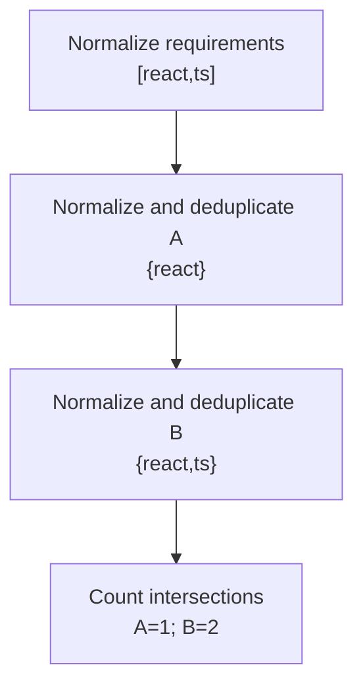

# Worked model: Counting distinct skills instead of repeated tokens

This is a solved teaching model, followed by ways to practice it. It is not a report of a newly discovered bug in lucasrouter. Read the full explanation, follow the table, or reconstruct it aloud; switch methods when one exposes a gap that another hides.

## Start with a concrete situation

Required skills are [React,TS]. Candidate A supplies [react, React ,react]; candidate B supplies [react,ts]. Normalize by trim and lowercase.

Pause here and write a prediction in one sentence. A prediction is useful even when it is wrong because it gives the explanation something specific to correct. Do not change your original note after reading the result; add a correction beside it.

## Follow the state, one step at a time

| Step | Action or observation | State or consequence |
|---|---|---|
| 1 | Normalize requirements | [react,ts] |
| 2 | Normalize and deduplicate A | {react} |
| 3 | Normalize and deduplicate B | {react,ts} |
| 4 | Count intersections | A=1; B=2 |

**Worked result:** B has two distinct required matches; A has one. Repetition does not increase the score.

Read down the state column without the prose. Then read the prose without the table. The two representations should describe the same mechanism. If an arrow in your mental picture has no corresponding step, identify the assumption you supplied yourself.

## See the same trace as a diagram

Each arrow means the next reasoning step in this teaching trace. It is not automatically a network request, transaction, or object reference. Compare a node with its table row and explain the transition before moving downward.

## Why this result follows

The raw array answers how many tokens were supplied. The toy score asks how many distinct required skills are represented. Those are different quantities. A Set becomes useful only after deciding which strings represent the same skill under this exercise's policy.

Normalization is not free permission to transform every identifier. Human-entered skill tokens are intentionally case-insensitive here. Opaque candidate IDs remain case-sensitive because the exercise defines them that way. Lowercasing a whole serialized object would mix those two contracts. Make each field's equivalence rule explicit before building a key or set.

The required list also supplies a useful order for explanations. If a candidate matches react but not ts, matched and missing can follow the normalized requirement order. That produces predictable output without pretending the order of repeated tokens in a candidate's input is a ranking signal. Ties in overall score need their own deterministic policy if the result is sorted.

This is a set-intersection lesson, not a hiring model. A count of matching labels does not establish competence, experience, or suitability. The practical engineering transfer is to define identity and denominators before calculating a score, then test duplicate and normalization cases so the number cannot be inflated by representation alone.

## The tempting explanation that fails

Counting every matching token rewards duplicate spellings of the same underlying skill.

The mistake is useful because it is plausible. A weak exercise simply says the wrong answer is wrong. A stronger one identifies the exact point where it stops matching the fixture. Return to the table and mark that row. If your proposed repair changes a different row, explain why it reaches the same mechanism rather than merely hiding its visible symptom.

## A second worked case

**Change:** Make the required list [React, React , empty-string]. What score should a candidate with react receive, and why is the denominator not three?

**Resolution:** After the declared normalization and removal of empty tokens, the required set contains one skill. The distinct-match count is one.

Compare the first and second cases by naming the changed assumption. Keep the other facts fixed while explaining the difference. This prevents a common learning trap: changing several things at once and crediting the result to whichever change seems most memorable.

## Connect the idea to this repository

The project involves a dispatcher or driver using the dispatch list and driver dialog. Compare this model with the local case **A list changes underneath a selection**: A dispatcher filters the list while a driver updates one stop. The selected row disappears from the visible list. The UI must keep entity identity distinct from its displayed position.

The project-specific rule in that case is: Selection refers to a stable stop ID; visibility is a separate fact.

The connection is an opportunity to compare boundaries, not permission to paste the toy algorithm into application code. Start at the [source map](../README.md). Locate the current caller, representation, validation, and state owner. If the concept is only indirectly relevant, explain the difference; for example, a local projection and a durable transaction may share a reasoning pattern without sharing an implementation.

## Practice by reading, drawing, building, and speaking

For a reading pass, explain one paragraph in your own words and attach it to a row of the trace. For a drawing pass, use boxes for values or owners and arrows for references or events; label what each arrow means so references are not confused with requests. For a building pass, construct the smallest fixture that distinguishes the correct result from the tempting shortcut. Keep it in practice files, not production code.

For a speaking pass, explain the setup and result in ninety seconds without naming a library. Then add the implementation detail that matters. If that detail cannot be connected to an observable consequence, it may not belong in the first explanation. A listener should be able to change one input and understand why your prediction changes or stays the same.

## A short journal entry to keep

Write four connected sentences: I initially predicted __ because __. The worked trace shows __ at step __. My revised rule is __, under assumptions __. I still need __ evidence before claiming __ about the application.

The last sentence matters. Understanding a pure model is useful progress, but it does not automatically verify browser interaction, database isolation, current production behavior, or another person's learning. Return tomorrow with a different fixture and see whether you can reconstruct the mechanism without rereading this page.
