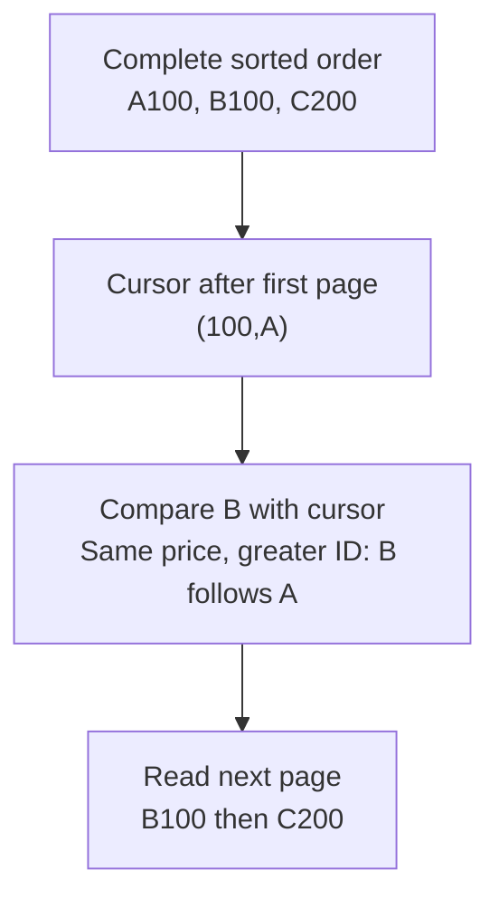

# Worked model: A cursor needs the same order as the list

This is a solved teaching model, followed by ways to practice it. It is not a report of a newly discovered bug in lucasrouter. Read the full explanation, follow the table, or reconstruct it aloud; switch methods when one exposes a gap that another hides.

## Start with a concrete situation

Catalog rows are A at100, B at100, and C at200. Sort by (price,id). The first page ends at A.

Pause here and write a prediction in one sentence. A prediction is useful even when it is wrong because it gives the explanation something specific to correct. Do not change your original note after reading the result; add a correction beside it.

## Follow the state, one step at a time

| Step | Action or observation | State or consequence |
|---|---|---|
| 1 | Complete sorted order | A100, B100, C200 |
| 2 | Cursor after first page | (100,A) |
| 3 | Compare B with cursor | Same price, greater ID: B follows A |
| 4 | Read next page | B100 then C200 |

**Worked result:** B must remain eligible. A price-only greater-than filter would skip it.

Read down the state column without the prose. Then read the prose without the table. The two representations should describe the same mechanism. If an arrow in your mental picture has no corresponding step, identify the assumption you supplied yourself.

## See the same trace as a diagram

Each arrow means the next reasoning step in this teaching trace. It is not automatically a network request, transaction, or object reference. Compare a node with its table row and explain the transition before moving downward.

## Why this result follows

A cursor is a description of a boundary in an ordering. If the ordering uses price and ID while the cursor records only price, the boundary has lost information. It cannot distinguish A from B when they share the same price. The skipped row follows from that missing distinction, not from random database behavior.

Use the same lexicographic comparison in sorting and in the after-cursor predicate. First compare price; when prices are equal, compare the opaque ID according to the stated order. A cursor need not still point to a stored row if it carries the comparison values needed to define the boundary. That is different from an offset that counts positions in the current result set.

A complete order still does not guarantee a stable multi-page snapshot. If B changes price between requests, it may move across the boundary. The application needs a policy for moving data, such as accepting a live view or using a snapshot mechanism. Do not credit a tie breaker with guarantees it cannot provide.

Work the fixture by hand before optimizing. The tiny three-row table is enough to expose the missing equal-price case. An integration check can later examine the actual query and index. The pure model establishes the tuple comparison, while a database execution plan and concurrent-update policy remain separate evidence.

## The tempting explanation that fails

Using price > 100 after returning A100 drops B100 even though it has not been returned.

The mistake is useful because it is plausible. A weak exercise simply says the wrong answer is wrong. A stronger one identifies the exact point where it stops matching the fixture. Return to the table and mark that row. If your proposed repair changes a different row, explain why it reaches the same mechanism rather than merely hiding its visible symptom.

## A second worked case

**Change:** Use a cursor (150,Z) that does not identify a row. Which rows in the original fixture follow it?

**Resolution:** Only C200 follows that pair. The comparison is defined by the tuple values; finding a matching cursor record is unnecessary under this contract.

Compare the first and second cases by naming the changed assumption. Keep the other facts fixed while explaining the difference. This prevents a common learning trap: changing several things at once and crediting the result to whichever change seems most memorable.

## Connect the idea to this repository

The project involves a dispatcher or driver using the dispatch list and driver dialog. Compare this model with the local case **A list changes underneath a selection**: A dispatcher filters the list while a driver updates one stop. The selected row disappears from the visible list. The UI must keep entity identity distinct from its displayed position.

The project-specific rule in that case is: Selection refers to a stable stop ID; visibility is a separate fact.

The connection is an opportunity to compare boundaries, not permission to paste the toy algorithm into application code. Start at the [source map](../README.md). Locate the current caller, representation, validation, and state owner. If the concept is only indirectly relevant, explain the difference; for example, a local projection and a durable transaction may share a reasoning pattern without sharing an implementation.

## Practice by reading, drawing, building, and speaking

For a reading pass, explain one paragraph in your own words and attach it to a row of the trace. For a drawing pass, use boxes for values or owners and arrows for references or events; label what each arrow means so references are not confused with requests. For a building pass, construct the smallest fixture that distinguishes the correct result from the tempting shortcut. Keep it in practice files, not production code.

For a speaking pass, explain the setup and result in ninety seconds without naming a library. Then add the implementation detail that matters. If that detail cannot be connected to an observable consequence, it may not belong in the first explanation. A listener should be able to change one input and understand why your prediction changes or stays the same.

## A short journal entry to keep

Write four connected sentences: I initially predicted __ because __. The worked trace shows __ at step __. My revised rule is __, under assumptions __. I still need __ evidence before claiming __ about the application.

The last sentence matters. Understanding a pure model is useful progress, but it does not automatically verify browser interaction, database isolation, current production behavior, or another person's learning. Return tomorrow with a different fixture and see whether you can reconstruct the mechanism without rereading this page.
