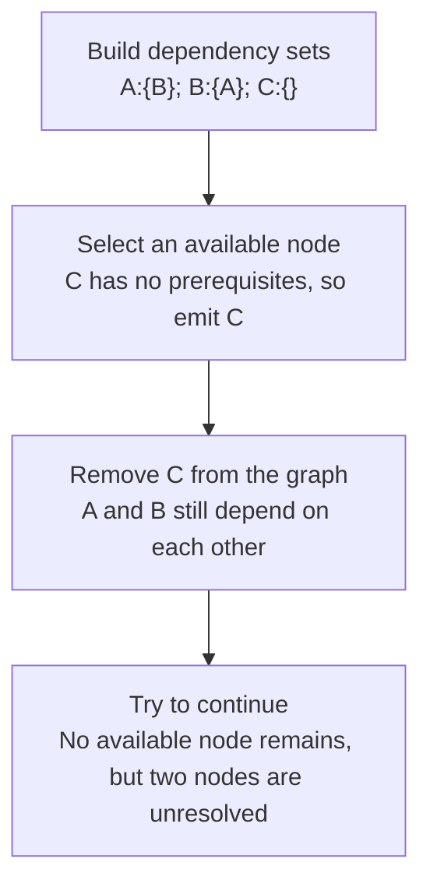

# Worked model: Following prerequisites until a cycle becomes visible

This is a solved teaching model, followed by ways to practice it. It is not a report of a newly discovered bug in lucasrouter. Read the full explanation, follow the table, or reconstruct it aloud; switch methods when one exposes a gap that another hides.

## Start with a concrete situation

Issues A and B depend on each other; issue C has no prerequisites. We want a complete prerequisite-first plan.

Pause here and write a prediction in one sentence. A prediction is useful even when it is wrong because it gives the explanation something specific to correct. Do not change your original note after reading the result; add a correction beside it.

## Follow the state, one step at a time

| Step | Action or observation | State or consequence |
|---|---|---|
| 1 | Build dependency sets | A:{B}; B:{A}; C:{} |
| 2 | Select an available node | C has no prerequisites, so emit C |
| 3 | Remove C from the graph | A and B still depend on each other |
| 4 | Try to continue | No available node remains, but two nodes are unresolved |

**Worked result:** Report a cycle. [C] is useful partial progress but not a successful complete plan.

Read down the state column without the prose. Then read the prose without the table. The two representations should describe the same mechanism. If an arrow in your mental picture has no corresponding step, identify the assumption you supplied yourself.

## See the same trace as a diagram

Each arrow means the next reasoning step in this teaching trace. It is not automatically a network request, transaction, or object reference. Compare a node with its table row and explain the transition before moving downward.

## Why this result follows

A topological planning algorithm repeatedly looks for work whose prerequisites are already satisfied. In the fixture, C is easy to emit, which can make the implementation appear successful in a casual demonstration. The decisive condition is what happens after that first step. If nodes remain and none is available, the graph cannot be completely ordered under the stated dependency relation.

Keep a missing dependency separate from a cycle. If A refers to an unknown X, the input contract is incomplete before planning begins. If A and B both exist and refer to each other, the graph contains a cyclic relationship. Distinguishing the two errors gives a caller a more useful correction than returning an unexplained empty array for both.

Duplicate dependency tokens also need a defined interpretation. If B lists A twice and the contract treats prerequisites as a set, completing A satisfies that dependency once. A raw count that increments twice but decrements once can create a false cycle. Constructing sets or otherwise accounting consistently for duplicates prevents that bookkeeping error.

The worked trace is more important than naming the algorithm from memory. A reader should be able to remove one emitted node, update remaining dependencies, and predict the next available set. For a deterministic result, choose an explicit tie rule among available nodes. That policy affects reproducibility but does not cure a cycle.

## The tempting explanation that fails

Return the emitted prefix and label it complete whenever the loop can no longer make progress.

The mistake is useful because it is plausible. A weak exercise simply says the wrong answer is wrong. A stronger one identifies the exact point where it stops matching the fixture. Return to the table and mark that row. If your proposed repair changes a different row, explain why it reaches the same mechanism rather than merely hiding its visible symptom.

## A second worked case

**Change:** Remove B’s dependency on A while keeping A dependent on B and C independent. Choose the smallest currently available ID each step.

**Resolution:** Initially B and C are available, so emit B. A then becomes available and sorts before C. The complete plan is [B,A,C].

Compare the first and second cases by naming the changed assumption. Keep the other facts fixed while explaining the difference. This prevents a common learning trap: changing several things at once and crediting the result to whichever change seems most memorable.

## Connect the idea to this repository

The project involves a dispatcher or driver using the dispatch list and driver dialog. Compare this model with the local case **A list changes underneath a selection**: A dispatcher filters the list while a driver updates one stop. The selected row disappears from the visible list. The UI must keep entity identity distinct from its displayed position.

The project-specific rule in that case is: Selection refers to a stable stop ID; visibility is a separate fact.

The connection is an opportunity to compare boundaries, not permission to paste the toy algorithm into application code. Start at the [source map](../README.md). Locate the current caller, representation, validation, and state owner. If the concept is only indirectly relevant, explain the difference; for example, a local projection and a durable transaction may share a reasoning pattern without sharing an implementation.

## Practice by reading, drawing, building, and speaking

For a reading pass, explain one paragraph in your own words and attach it to a row of the trace. For a drawing pass, use boxes for values or owners and arrows for references or events; label what each arrow means so references are not confused with requests. For a building pass, construct the smallest fixture that distinguishes the correct result from the tempting shortcut. Keep it in practice files, not production code.

For a speaking pass, explain the setup and result in ninety seconds without naming a library. Then add the implementation detail that matters. If that detail cannot be connected to an observable consequence, it may not belong in the first explanation. A listener should be able to change one input and understand why your prediction changes or stays the same.

## A short journal entry to keep

Write four connected sentences: I initially predicted __ because __. The worked trace shows __ at step __. My revised rule is __, under assumptions __. I still need __ evidence before claiming __ about the application.

The last sentence matters. Understanding a pure model is useful progress, but it does not automatically verify browser interaction, database isolation, current production behavior, or another person's learning. Return tomorrow with a different fixture and see whether you can reconstruct the mechanism without rereading this page.
