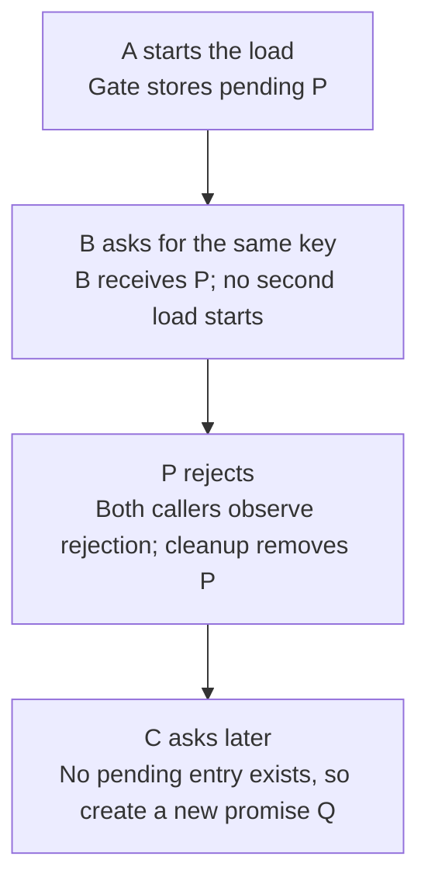

# Worked model: One rejected shared operation must not block every future caller

This is a solved teaching model, followed by ways to practice it. It is not a report of a newly discovered bug in lucasrouter. Read the full explanation, follow the table, or reconstruct it aloud; switch methods when one exposes a gap that another hides.

## Start with a concrete situation

Callers A and B request the same pending load and share promise P. P rejects. Later caller C wants to try again.

Pause here and write a prediction in one sentence. A prediction is useful even when it is wrong because it gives the explanation something specific to correct. Do not change your original note after reading the result; add a correction beside it.

## Follow the state, one step at a time

| Step | Action or observation | State or consequence |
|---|---|---|
| 1 | A starts the load | Gate stores pending P |
| 2 | B asks for the same key | B receives P; no second load starts |
| 3 | P rejects | Both callers observe rejection; cleanup removes P |
| 4 | C asks later | No pending entry exists, so create a new promise Q |

**Worked result:** The failed attempt is shared, but failure does not permanently occupy the in-flight gate.

Read down the state column without the prose. Then read the prose without the table. The two representations should describe the same mechanism. If an arrow in your mental picture has no corresponding step, identify the assumption you supplied yourself.

## See the same trace as a diagram

Each arrow means the next reasoning step in this teaching trace. It is not automatically a network request, transaction, or object reference. Compare a node with its table row and explain the transition before moving downward.

## Why this result follows

The phrase share a request can hide two different policies. An in-flight gate shares only work that is currently pending. A cache may intentionally retain settled success or failure. If the helper is an in-flight gate, leaving a rejected promise in the map changes its contract into permanent failure caching. Every later caller then receives the old rejection without performing a new attempt.

Cleanup belongs on both settlement paths. A success-only branch is easy to write because the happy path gets the most attention, but rejection is the path that determines whether recovery is possible. The promise returned to callers should still preserve the original success or error unless the contract explicitly transforms it; cleanup must not accidentally swallow the failure.

There is also a launch boundary. A loader can throw synchronously before returning a promise. A wrapper that deliberately invokes it through a promise continuation can turn that into a rejection visible to the same cleanup structure. State this behavior rather than assuming every supplied function is already asynchronous.

To test the mechanism, count loader starts and control settlement. Two simultaneous callers should share one attempt. After rejection and observed cleanup, a later caller should start another. No arbitrary sleep is needed. The test establishes local sharing; it does not deduplicate side effects across processes or provide durable operation identity.

## The tempting explanation that fails

Clear the pending entry only after success, leaving rejected P in the map forever.

The mistake is useful because it is plausible. A weak exercise simply says the wrong answer is wrong. A stronger one identifies the exact point where it stops matching the fixture. Return to the table and mark that row. If your proposed repair changes a different row, explain why it reaches the same mechanism rather than merely hiding its visible symptom.

## A second worked case

**Change:** Callers A and B use different keys. Should an in-flight gate force them to share one global promise?

**Resolution:** No, not under a per-key contract. Distinct identities can require different results. Sharing scope must match the result being requested.

Compare the first and second cases by naming the changed assumption. Keep the other facts fixed while explaining the difference. This prevents a common learning trap: changing several things at once and crediting the result to whichever change seems most memorable.

## Connect the idea to this repository

The project involves a dispatcher or driver using the dispatch list and driver dialog. Compare this model with the local case **Undo arrives after newer work**: A stop is marked delivered, later marked failed, and then an older undo action arrives. This interview uses a synthetic revision contract, not an assertion that the current store has revisions.

The project-specific rule in that case is: An old undo must not overwrite a newer accepted change.

The connection is an opportunity to compare boundaries, not permission to paste the toy algorithm into application code. Start at the [source map](../README.md). Locate the current caller, representation, validation, and state owner. If the concept is only indirectly relevant, explain the difference; for example, a local projection and a durable transaction may share a reasoning pattern without sharing an implementation.

## Practice by reading, drawing, building, and speaking

For a reading pass, explain one paragraph in your own words and attach it to a row of the trace. For a drawing pass, use boxes for values or owners and arrows for references or events; label what each arrow means so references are not confused with requests. For a building pass, construct the smallest fixture that distinguishes the correct result from the tempting shortcut. Keep it in practice files, not production code.

For a speaking pass, explain the setup and result in ninety seconds without naming a library. Then add the implementation detail that matters. If that detail cannot be connected to an observable consequence, it may not belong in the first explanation. A listener should be able to change one input and understand why your prediction changes or stays the same.

## A short journal entry to keep

Write four connected sentences: I initially predicted __ because __. The worked trace shows __ at step __. My revised rule is __, under assumptions __. I still need __ evidence before claiming __ about the application.

The last sentence matters. Understanding a pure model is useful progress, but it does not automatically verify browser interaction, database isolation, current production behavior, or another person's learning. Return tomorrow with a different fixture and see whether you can reconstruct the mechanism without rereading this page.
