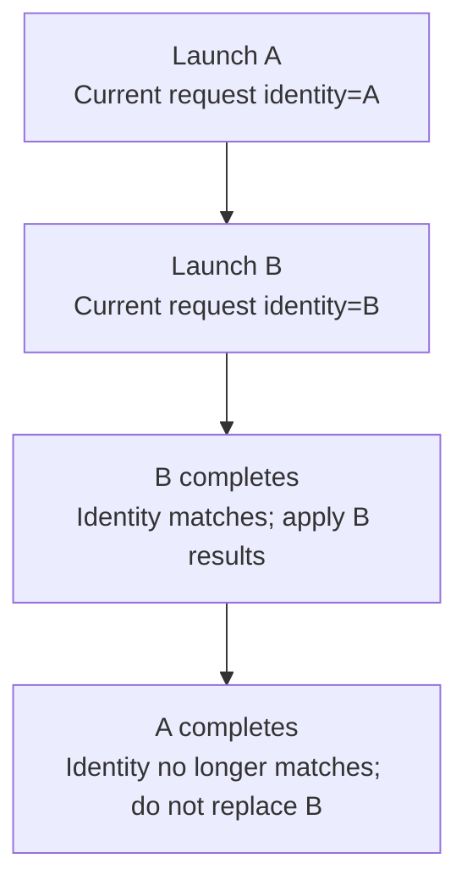

# Worked model: A response belongs to the request that produced it

This is a solved teaching model, followed by ways to practice it. It is not a report of a newly discovered bug in lucasrouter. Read the full explanation, follow the table, or reconstruct it aloud; switch methods when one exposes a gap that another hides.

## Start with a concrete situation

Search A starts for react, then search B starts for typescript. B returns first. A returns later with an otherwise successful response.

Pause here and write a prediction in one sentence. A prediction is useful even when it is wrong because it gives the explanation something specific to correct. Do not change your original note after reading the result; add a correction beside it.

## Follow the state, one step at a time

| Step | Action or observation | State or consequence |
|---|---|---|
| 1 | Launch A | Current request identity=A |
| 2 | Launch B | Current request identity=B |
| 3 | B completes | Identity matches; apply B results |
| 4 | A completes | Identity no longer matches; do not replace B |

**Worked result:** The view keeps the results for B. Arrival order alone does not determine which result is current.

Read down the state column without the prose. Then read the prose without the table. The two representations should describe the same mechanism. If an arrow in your mental picture has no corresponding step, identify the assumption you supplied yourself.

## See the same trace as a diagram

Each arrow means the next reasoning step in this teaching trace. It is not automatically a network request, transaction, or object reference. Compare a node with its table row and explain the transition before moving downward.

## Why this result follows

A stale response is not necessarily an erroneous response. A may accurately answer its original question. The problem is applying that answer to a view that now asks a different question. This is why a generic catch block or a faster request does not resolve the ownership issue.

Associate each launched operation with enough identity to compare it with the current view. A monotonically increasing local request generation can distinguish successive searches. A scope such as organization or world must also be represented when the same local query can mean different data. The check occurs when applying the result because the relevant state can change after launch.

Abort can reduce wasted work, but it should not be the only reasoning step. The old response may already be available or a dependency may not support cancellation. An explicit application check makes the ownership rule testable regardless of whether cancellation succeeds. It also explains what happens on unmount or when an entirely different entity is selected.

The deterministic reproduction is small: launch both operations, resolve B, inspect the view, resolve A, and inspect it again. The second assertion is the one that rejects the tempting implementation. Merely awaiting both promises and checking that neither threw would miss the stale overwrite.

## The tempting explanation that fails

Every successful completion writes to the same results state, allowing the old search to overwrite the current one.

The mistake is useful because it is plausible. A weak exercise simply says the wrong answer is wrong. A stronger one identifies the exact point where it stops matching the fixture. Return to the table and mark that row. If your proposed repair changes a different row, explain why it reaches the same mechanism rather than merely hiding its visible symptom.

## A second worked case

**Change:** A and B have identical query text but belong to different organizations. Is query text alone a sufficient ownership check?

**Resolution:** No. Scope changes the meaning and authorization of the result. Compare the organization or equivalent scope identity as well.

Compare the first and second cases by naming the changed assumption. Keep the other facts fixed while explaining the difference. This prevents a common learning trap: changing several things at once and crediting the result to whichever change seems most memorable.

## Connect the idea to this repository

The project involves a dispatcher or driver using the dispatch list and driver dialog. Compare this model with the local case **A list changes underneath a selection**: A dispatcher filters the list while a driver updates one stop. The selected row disappears from the visible list. The UI must keep entity identity distinct from its displayed position.

The project-specific rule in that case is: Selection refers to a stable stop ID; visibility is a separate fact.

The connection is an opportunity to compare boundaries, not permission to paste the toy algorithm into application code. Start at the [source map](../README.md). Locate the current caller, representation, validation, and state owner. If the concept is only indirectly relevant, explain the difference; for example, a local projection and a durable transaction may share a reasoning pattern without sharing an implementation.

## Practice by reading, drawing, building, and speaking

For a reading pass, explain one paragraph in your own words and attach it to a row of the trace. For a drawing pass, use boxes for values or owners and arrows for references or events; label what each arrow means so references are not confused with requests. For a building pass, construct the smallest fixture that distinguishes the correct result from the tempting shortcut. Keep it in practice files, not production code.

For a speaking pass, explain the setup and result in ninety seconds without naming a library. Then add the implementation detail that matters. If that detail cannot be connected to an observable consequence, it may not belong in the first explanation. A listener should be able to change one input and understand why your prediction changes or stays the same.

## A short journal entry to keep

Write four connected sentences: I initially predicted __ because __. The worked trace shows __ at step __. My revised rule is __, under assumptions __. I still need __ evidence before claiming __ about the application.

The last sentence matters. Understanding a pure model is useful progress, but it does not automatically verify browser interaction, database isolation, current production behavior, or another person's learning. Return tomorrow with a different fixture and see whether you can reconstruct the mechanism without rereading this page.
