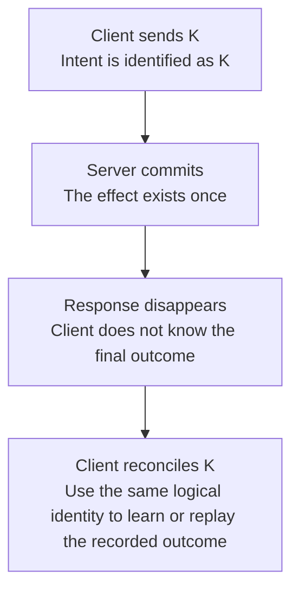

# Worked model: A missing response is not proof of a missing effect

This is a solved teaching model, followed by ways to practice it. It is not a report of a newly discovered bug in lucasrouter. Read the full explanation, follow the table, or reconstruct it aloud; switch methods when one exposes a gap that another hides.

## Start with a concrete situation

A client submits logical command K. The server commits its effect, but the response is lost. The client sees a timeout.

Pause here and write a prediction in one sentence. A prediction is useful even when it is wrong because it gives the explanation something specific to correct. Do not change your original note after reading the result; add a correction beside it.

## Follow the state, one step at a time

| Step | Action or observation | State or consequence |
|---|---|---|
| 1 | Client sends K | Intent is identified as K |
| 2 | Server commits | The effect exists once |
| 3 | Response disappears | Client does not know the final outcome |
| 4 | Client reconciles K | Use the same logical identity to learn or replay the recorded outcome |

**Worked result:** The client has an uncertain result. Starting a fresh unrelated command can duplicate the original intent.

Read down the state column without the prose. Then read the prose without the table. The two representations should describe the same mechanism. If an arrow in your mental picture has no corresponding step, identify the assumption you supplied yourself.

## See the same trace as a diagram

Each arrow means the next reasoning step in this teaching trace. It is not automatically a network request, transaction, or object reference. Compare a node with its table row and explain the transition before moving downward.

## Why this result follows

Timeout describes the client's observation window. It does not tell us whether the server received the request, whether the effect committed, or whether only the response was lost. Treating every timeout as a definite failure collapses several materially different states into one message.

A durable command identity can connect a retry with the original intent, but merely attaching a random string does not implement idempotency. The server must define how it stores and compares that identity, how it handles conflicting payloads, and how the recorded result relates atomically to the effect. A process-local promise map disappears on restart and does not establish that durable contract.

The interface can help without pretending certainty. It can keep the operation pending or unknown, offer a bounded status check, and retain the identity needed for reconciliation. It should not immediately suggest a brand-new purchase or another irreversible action solely because the first response was absent.

A worked test needs to place the failure after the effect but before the caller receives confirmation. Failing before the request reaches the server tests a different window. The pure timeline explains the policy; actual persistence and provider behavior require their own controlled integration evidence.

## The tempting explanation that fails

Generate a new operation ID after every timeout and assume the earlier action never happened.

The mistake is useful because it is plausible. A weak exercise simply says the wrong answer is wrong. A stronger one identifies the exact point where it stops matching the fixture. Return to the table and mark that row. If your proposed repair changes a different row, explain why it reaches the same mechanism rather than merely hiding its visible symptom.

## A second worked case

**Change:** The server receives K again with a different payload. Should it silently return the first result or perform a new effect?

**Resolution:** The contract needs an explicit conflict policy. Reusing an identity for different intent must not silently create an unrelated second effect.

Compare the first and second cases by naming the changed assumption. Keep the other facts fixed while explaining the difference. This prevents a common learning trap: changing several things at once and crediting the result to whichever change seems most memorable.

## Connect the idea to this repository

The project involves a dispatcher or driver using the dispatch list and driver dialog. Compare this model with the local case **Undo arrives after newer work**: A stop is marked delivered, later marked failed, and then an older undo action arrives. This interview uses a synthetic revision contract, not an assertion that the current store has revisions.

The project-specific rule in that case is: An old undo must not overwrite a newer accepted change.

The connection is an opportunity to compare boundaries, not permission to paste the toy algorithm into application code. Start at the [source map](../README.md). Locate the current caller, representation, validation, and state owner. If the concept is only indirectly relevant, explain the difference; for example, a local projection and a durable transaction may share a reasoning pattern without sharing an implementation.

## Practice by reading, drawing, building, and speaking

For a reading pass, explain one paragraph in your own words and attach it to a row of the trace. For a drawing pass, use boxes for values or owners and arrows for references or events; label what each arrow means so references are not confused with requests. For a building pass, construct the smallest fixture that distinguishes the correct result from the tempting shortcut. Keep it in practice files, not production code.

For a speaking pass, explain the setup and result in ninety seconds without naming a library. Then add the implementation detail that matters. If that detail cannot be connected to an observable consequence, it may not belong in the first explanation. A listener should be able to change one input and understand why your prediction changes or stays the same.

## A short journal entry to keep

Write four connected sentences: I initially predicted __ because __. The worked trace shows __ at step __. My revised rule is __, under assumptions __. I still need __ evidence before claiming __ about the application.

The last sentence matters. Understanding a pure model is useful progress, but it does not automatically verify browser interaction, database isolation, current production behavior, or another person's learning. Return tomorrow with a different fixture and see whether you can reconstruct the mechanism without rereading this page.
