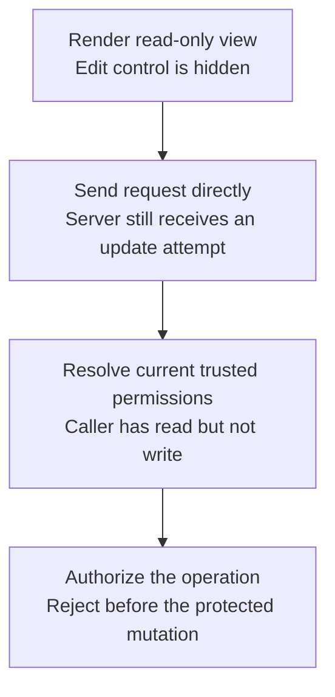

# Worked model: A hidden button is not an authorization decision

This is a solved teaching model, followed by ways to practice it. It is not a report of a newly discovered bug in lucasrouter. Read the full explanation, follow the table, or reconstruct it aloud; switch methods when one exposes a gap that another hides.

## Start with a concrete situation

The UI hides an edit button for a read-only member. A caller directly sends the same update request with an authenticated session.

Pause here and write a prediction in one sentence. A prediction is useful even when it is wrong because it gives the explanation something specific to correct. Do not change your original note after reading the result; add a correction beside it.

## Follow the state, one step at a time

| Step | Action or observation | State or consequence |
|---|---|---|
| 1 | Render read-only view | Edit control is hidden |
| 2 | Send request directly | Server still receives an update attempt |
| 3 | Resolve current trusted permissions | Caller has read but not write |
| 4 | Authorize the operation | Reject before the protected mutation |

**Worked result:** The server must deny the write independently of how the browser rendered the control.

Read down the state column without the prose. Then read the prose without the table. The two representations should describe the same mechanism. If an arrow in your mental picture has no corresponding step, identify the assumption you supplied yourself.

## See the same trace as a diagram

Each arrow means the next reasoning step in this teaching trace. It is not automatically a network request, transaction, or object reference. Compare a node with its table row and explain the transition before moving downward.

## Why this result follows

The browser can make an interface easier to use by showing actions that are likely to be allowed. That presentation is not a trustworthy enforcement boundary. A caller can construct a request without using the component, and an open component can hold permissions that were accurate earlier but have since changed.

Authentication and authorization therefore answer separate questions. A valid session identifies the accepted caller. The operation still needs to decide whether that caller may perform this action on this resource in this scope. A role supplied by the browser is input to inspect, not automatically a trusted fact to apply.

The same distinction applies to hidden response fields. If a private note is already present in an API response, choosing not to render it does not prevent the browser user from accessing it. Protect the response shape or deny access at the server boundary, then use UI behavior to communicate the result clearly.

The useful test bypasses the component and calls the protected boundary with a disallowed context. Assert the rejected outcome and unchanged stored data. A component test that confirms the button is absent proves the presentation rule only. Both tests can be useful, but their evidence should not be merged into one broad security claim.

## The tempting explanation that fails

Trust the role string or enabled state sent back by a browser because the current UI normally sets it correctly.

The mistake is useful because it is plausible. A weak exercise simply says the wrong answer is wrong. A stronger one identifies the exact point where it stops matching the fixture. Return to the table and mark that row. If your proposed repair changes a different row, explain why it reaches the same mechanism rather than merely hiding its visible symptom.

## A second worked case

**Change:** The user was an administrator when the editor opened but is a member at save time. Which permission observation should control the write?

**Resolution:** The server’s current trusted authorization policy controls the operation, subject to its explicit consistency model. The old UI state cannot grant authority.

Compare the first and second cases by naming the changed assumption. Keep the other facts fixed while explaining the difference. This prevents a common learning trap: changing several things at once and crediting the result to whichever change seems most memorable.

## Connect the idea to this repository

The project involves a dispatcher or driver using the dispatch list and driver dialog. Compare this model with the local case **Proof and status disagree**: A report says a stop is delivered while its required proof field is absent. The candidate must distinguish UI form validation from the domain transition and historical-data policy.

The project-specific rule in that case is: A transition must satisfy the chosen status-and-proof contract at its authority boundary.

The connection is an opportunity to compare boundaries, not permission to paste the toy algorithm into application code. Start at the [source map](../README.md). Locate the current caller, representation, validation, and state owner. If the concept is only indirectly relevant, explain the difference; for example, a local projection and a durable transaction may share a reasoning pattern without sharing an implementation.

## Practice by reading, drawing, building, and speaking

For a reading pass, explain one paragraph in your own words and attach it to a row of the trace. For a drawing pass, use boxes for values or owners and arrows for references or events; label what each arrow means so references are not confused with requests. For a building pass, construct the smallest fixture that distinguishes the correct result from the tempting shortcut. Keep it in practice files, not production code.

For a speaking pass, explain the setup and result in ninety seconds without naming a library. Then add the implementation detail that matters. If that detail cannot be connected to an observable consequence, it may not belong in the first explanation. A listener should be able to change one input and understand why your prediction changes or stays the same.

## A short journal entry to keep

Write four connected sentences: I initially predicted __ because __. The worked trace shows __ at step __. My revised rule is __, under assumptions __. I still need __ evidence before claiming __ about the application.

The last sentence matters. Understanding a pure model is useful progress, but it does not automatically verify browser interaction, database isolation, current production behavior, or another person's learning. Return tomorrow with a different fixture and see whether you can reconstruct the mechanism without rereading this page.
