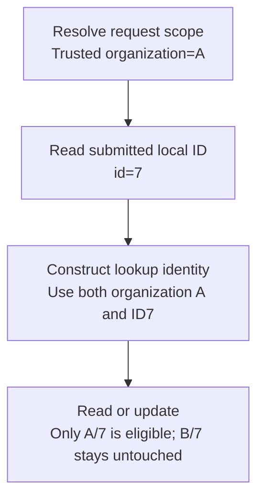

# Worked model: The same local ID can mean different records

This is a solved teaching model, followed by ways to practice it. It is not a report of a newly discovered bug in lucasrouter. Read the full explanation, follow the table, or reconstruct it aloud; switch methods when one exposes a gap that another hides.

## Start with a concrete situation

Organizations A and B each contain a record with local ID7. The trusted request scope is A.

Pause here and write a prediction in one sentence. A prediction is useful even when it is wrong because it gives the explanation something specific to correct. Do not change your original note after reading the result; add a correction beside it.

## Follow the state, one step at a time

| Step | Action or observation | State or consequence |
|---|---|---|
| 1 | Resolve request scope | Trusted organization=A |
| 2 | Read submitted local ID | id=7 |
| 3 | Construct lookup identity | Use both organization A and ID7 |
| 4 | Read or update | Only A/7 is eligible; B/7 stays untouched |

**Worked result:** The local ID is insufficient on its own. Scope is part of the resource identity or query predicate.

Read down the state column without the prose. Then read the prose without the table. The two representations should describe the same mechanism. If an arrow in your mental picture has no corresponding step, identify the assumption you supplied yourself.

## See the same trace as a diagram

Each arrow means the next reasoning step in this teaching trace. It is not automatically a network request, transaction, or object reference. Compare a node with its table row and explain the transition before moving downward.

## Why this result follows

A fixture with only one organization can let an unscoped query appear correct. The code asks for ID7 and happens to receive the only seeded record. Adding B/7 exposes the missing boundary because the ID no longer identifies one authorized resource by itself.

Trace where scope becomes trusted. A submitted header, path parameter, or form field may request an organization, but membership or another application policy must authorize that request. Passing the same untrusted string through several helper functions does not transform it into authority.

Then trace the actual data predicate. Even with correctly resolved context, a repository function can accidentally omit the organization condition. The test should therefore reach the real query boundary when making an isolation claim. A mock that always returns scoped data assumes the property the implementation needs to demonstrate.

Response policy for an inaccessible identifier is a separate choice. An application may avoid revealing whether an out-of-scope record exists. The invariant is that the caller does not gain unauthorized data or mutate B/7. Keep that invariant distinct from the exact error code or message chosen by the API contract.

## The tempting explanation that fails

Use an authenticated caller plus an unscoped ID lookup and assume authentication supplies the missing predicate.

The mistake is useful because it is plausible. A weak exercise simply says the wrong answer is wrong. A stronger one identifies the exact point where it stops matching the fixture. Return to the table and mark that row. If your proposed repair changes a different row, explain why it reaches the same mechanism rather than merely hiding its visible symptom.

## A second worked case

**Change:** Only B/7 exists. The request is still scoped to A. Does the globally existing ID become eligible?

**Resolution:** No. The scoped lookup has no eligible record in A. Existence elsewhere does not create permission or a match within the requested scope.

Compare the first and second cases by naming the changed assumption. Keep the other facts fixed while explaining the difference. This prevents a common learning trap: changing several things at once and crediting the result to whichever change seems most memorable.

## Connect the idea to this repository

The project involves a dispatcher or driver using the dispatch list and driver dialog. Compare this model with the local case **A list changes underneath a selection**: A dispatcher filters the list while a driver updates one stop. The selected row disappears from the visible list. The UI must keep entity identity distinct from its displayed position.

The project-specific rule in that case is: Selection refers to a stable stop ID; visibility is a separate fact.

The connection is an opportunity to compare boundaries, not permission to paste the toy algorithm into application code. Start at the [source map](../README.md). Locate the current caller, representation, validation, and state owner. If the concept is only indirectly relevant, explain the difference; for example, a local projection and a durable transaction may share a reasoning pattern without sharing an implementation.

## Practice by reading, drawing, building, and speaking

For a reading pass, explain one paragraph in your own words and attach it to a row of the trace. For a drawing pass, use boxes for values or owners and arrows for references or events; label what each arrow means so references are not confused with requests. For a building pass, construct the smallest fixture that distinguishes the correct result from the tempting shortcut. Keep it in practice files, not production code.

For a speaking pass, explain the setup and result in ninety seconds without naming a library. Then add the implementation detail that matters. If that detail cannot be connected to an observable consequence, it may not belong in the first explanation. A listener should be able to change one input and understand why your prediction changes or stays the same.

## A short journal entry to keep

Write four connected sentences: I initially predicted __ because __. The worked trace shows __ at step __. My revised rule is __, under assumptions __. I still need __ evidence before claiming __ about the application.

The last sentence matters. Understanding a pure model is useful progress, but it does not automatically verify browser interaction, database isolation, current production behavior, or another person's learning. Return tomorrow with a different fixture and see whether you can reconstruct the mechanism without rereading this page.
