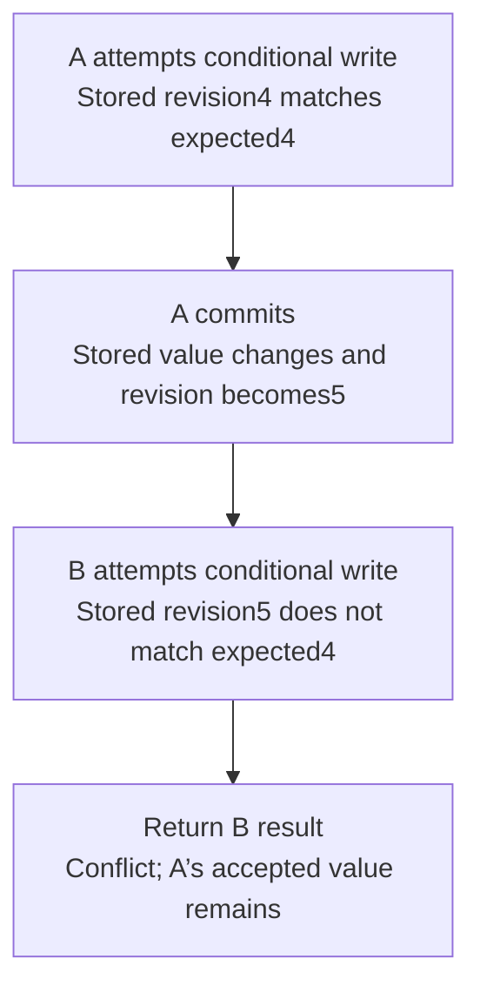

# Worked model: Two editors compete for one revision

This is a solved teaching model, followed by ways to practice it. It is not a report of a newly discovered bug in lucasrouter. Read the full explanation, follow the table, or reconstruct it aloud; switch methods when one exposes a gap that another hides.

## Start with a concrete situation

A record starts at revision4. Editors A and B both read it. Each submits a different change with expectedRevision=4.

Pause here and write a prediction in one sentence. A prediction is useful even when it is wrong because it gives the explanation something specific to correct. Do not change your original note after reading the result; add a correction beside it.

## Follow the state, one step at a time

| Step | Action or observation | State or consequence |
|---|---|---|
| 1 | A attempts conditional write | Stored revision4 matches expected4 |
| 2 | A commits | Stored value changes and revision becomes5 |
| 3 | B attempts conditional write | Stored revision5 does not match expected4 |
| 4 | Return B result | Conflict; A’s accepted value remains |

**Worked result:** Only one revision4 change succeeds under this compare-and-set contract.

Read down the state column without the prose. Then read the prose without the table. The two representations should describe the same mechanism. If an arrow in your mental picture has no corresponding step, identify the assumption you supplied yourself.

## See the same trace as a diagram

Each arrow means the next reasoning step in this teaching trace. It is not automatically a network request, transaction, or object reference. Compare a node with its table row and explain the transition before moving downward.

## Why this result follows

The expected revision describes the state on which the editor based its decision. Comparing it at the write boundary prevents a later save from silently overwriting changes made since that read. The user can then reconcile the conflict using the newer authoritative value.

The word at matters. A separate SELECT that checks revision4 followed later by an unconditional UPDATE can race. Both callers may pass the SELECT before either writes. The condition must participate in an atomic write or an equivalent transactional mechanism that actually enforces the rule under competing callers.

What counts as a revision-changing operation is part of the contract. An undo that successfully reverses a prior effect can itself be a new accepted transition rather than moving the revision backward. Otherwise an old token might become accidentally valid again. The teaching example does not claim every existing project already has this revision field.

The strongest reproduction deliberately starts two operations from the same observed revision and inspects committed outcomes. A serial test where B reads after A commits cannot reveal the lost-update window. A pure helper can model the decision table, but database concurrency needs evidence at the database boundary.

## The tempting explanation that fails

Check the revision during an earlier read, then issue an unconditional write later.

The mistake is useful because it is plausible. A weak exercise simply says the wrong answer is wrong. A stronger one identifies the exact point where it stops matching the fixture. Return to the table and mark that row. If your proposed repair changes a different row, explain why it reaches the same mechanism rather than merely hiding its visible symptom.

## A second worked case

**Change:** B reloads revision5, deliberately incorporates A’s change, and submits expectedRevision=5. Must this new attempt fail because B failed earlier?

**Resolution:** No. It is a new decision based on the current state. It can succeed if the conditional write still matches revision5 and all other rules hold.

Compare the first and second cases by naming the changed assumption. Keep the other facts fixed while explaining the difference. This prevents a common learning trap: changing several things at once and crediting the result to whichever change seems most memorable.

## Connect the idea to this repository

The project involves a dispatcher or driver using the dispatch list and driver dialog. Compare this model with the local case **Undo arrives after newer work**: A stop is marked delivered, later marked failed, and then an older undo action arrives. This interview uses a synthetic revision contract, not an assertion that the current store has revisions.

The project-specific rule in that case is: An old undo must not overwrite a newer accepted change.

The connection is an opportunity to compare boundaries, not permission to paste the toy algorithm into application code. Start at the [source map](../README.md). Locate the current caller, representation, validation, and state owner. If the concept is only indirectly relevant, explain the difference; for example, a local projection and a durable transaction may share a reasoning pattern without sharing an implementation.

## Practice by reading, drawing, building, and speaking

For a reading pass, explain one paragraph in your own words and attach it to a row of the trace. For a drawing pass, use boxes for values or owners and arrows for references or events; label what each arrow means so references are not confused with requests. For a building pass, construct the smallest fixture that distinguishes the correct result from the tempting shortcut. Keep it in practice files, not production code.

For a speaking pass, explain the setup and result in ninety seconds without naming a library. Then add the implementation detail that matters. If that detail cannot be connected to an observable consequence, it may not belong in the first explanation. A listener should be able to change one input and understand why your prediction changes or stays the same.

## A short journal entry to keep

Write four connected sentences: I initially predicted __ because __. The worked trace shows __ at step __. My revised rule is __, under assumptions __. I still need __ evidence before claiming __ about the application.

The last sentence matters. Understanding a pure model is useful progress, but it does not automatically verify browser interaction, database isolation, current production behavior, or another person's learning. Return tomorrow with a different fixture and see whether you can reconstruct the mechanism without rereading this page.
