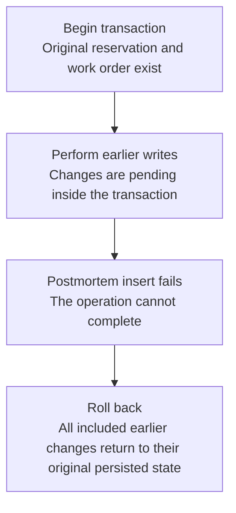

# Worked model: A late failure must undo earlier included writes

This is a solved teaching model, followed by ways to practice it. It is not a report of a newly discovered bug in lucasrouter. Read the full explanation, follow the table, or reconstruct it aloud; switch methods when one exposes a gap that another hides.

## Start with a concrete situation

A synthetic repair transaction consumes a reservation, completes a work order, writes an audit, and then fails while inserting a postmortem.

Pause here and write a prediction in one sentence. A prediction is useful even when it is wrong because it gives the explanation something specific to correct. Do not change your original note after reading the result; add a correction beside it.

## Follow the state, one step at a time

| Step | Action or observation | State or consequence |
|---|---|---|
| 1 | Begin transaction | Original reservation and work order exist |
| 2 | Perform earlier writes | Changes are pending inside the transaction |
| 3 | Postmortem insert fails | The operation cannot complete |
| 4 | Roll back | All included earlier changes return to their original persisted state |

**Worked result:** The work order, reservation, and audit must match the pre-transaction state if they belong to the same atomic operation.

Read down the state column without the prose. Then read the prose without the table. The two representations should describe the same mechanism. If an arrow in your mental picture has no corresponding step, identify the assumption you supplied yourself.

## See the same trace as a diagram

Each arrow means the next reasoning step in this teaching trace. It is not automatically a network request, transaction, or object reference. Compare a node with its table row and explain the transition before moving downward.

## Why this result follows

A failure at the last step is a useful teaching case because it exercises the entire boundary. Failing at the first step can leave nothing to roll back and therefore provide weak evidence that later writes are actually grouped. The intended contract concerns all included effects, not merely the exception seen by the caller.

List the writes explicitly before testing. Reservation consumption, work-order status, related releases, audit rows, and command receipts can each leak if they use the wrong connection or sit outside the transaction. An assertion on only the final work-order status might miss those partial effects. The verification should inspect every relevant persisted consequence after the forced failure.

A remote side effect is not automatically included in a local database transaction. If an email, payment, or external command is sent before commit, rolling back local rows does not necessarily reverse that effect. The design needs a separate delivery or reconciliation policy at that boundary. Do not infer distributed atomicity from the presence of a transaction keyword.

In Helios, existing records describe a real focused rollback regression; reading it is an opportunity to explain its evidence, not to claim a new defect was discovered. In another project, this chapter remains a synthetic transaction model until its actual writes and tests are located.

## The tempting explanation that fails

Assert only that an error was thrown, or mock the repository so no real partial writes can ever occur.

The mistake is useful because it is plausible. A weak exercise simply says the wrong answer is wrong. A stronger one identifies the exact point where it stops matching the fixture. Return to the table and mark that row. If your proposed repair changes a different row, explain why it reaches the same mechanism rather than merely hiding its visible symptom.

## A second worked case

**Change:** After rollback, retry the same logical command with the fault removed. Then replay it after success. What two outcomes should a durable idempotency contract distinguish?

**Resolution:** The first retry may perform the operation once because the failed transaction committed no result. The later replay should return the recorded successful outcome without repeating effects.

Compare the first and second cases by naming the changed assumption. Keep the other facts fixed while explaining the difference. This prevents a common learning trap: changing several things at once and crediting the result to whichever change seems most memorable.

## Connect the idea to this repository

The project involves a dispatcher or driver using the dispatch list and driver dialog. Compare this model with the local case **Undo arrives after newer work**: A stop is marked delivered, later marked failed, and then an older undo action arrives. This interview uses a synthetic revision contract, not an assertion that the current store has revisions.

The project-specific rule in that case is: An old undo must not overwrite a newer accepted change.

The connection is an opportunity to compare boundaries, not permission to paste the toy algorithm into application code. Start at the [source map](../README.md). Locate the current caller, representation, validation, and state owner. If the concept is only indirectly relevant, explain the difference; for example, a local projection and a durable transaction may share a reasoning pattern without sharing an implementation.

## Practice by reading, drawing, building, and speaking

For a reading pass, explain one paragraph in your own words and attach it to a row of the trace. For a drawing pass, use boxes for values or owners and arrows for references or events; label what each arrow means so references are not confused with requests. For a building pass, construct the smallest fixture that distinguishes the correct result from the tempting shortcut. Keep it in practice files, not production code.

For a speaking pass, explain the setup and result in ninety seconds without naming a library. Then add the implementation detail that matters. If that detail cannot be connected to an observable consequence, it may not belong in the first explanation. A listener should be able to change one input and understand why your prediction changes or stays the same.

## A short journal entry to keep

Write four connected sentences: I initially predicted __ because __. The worked trace shows __ at step __. My revised rule is __, under assumptions __. I still need __ evidence before claiming __ about the application.

The last sentence matters. Understanding a pure model is useful progress, but it does not automatically verify browser interaction, database isolation, current production behavior, or another person's learning. Return tomorrow with a different fixture and see whether you can reconstruct the mechanism without rereading this page.
