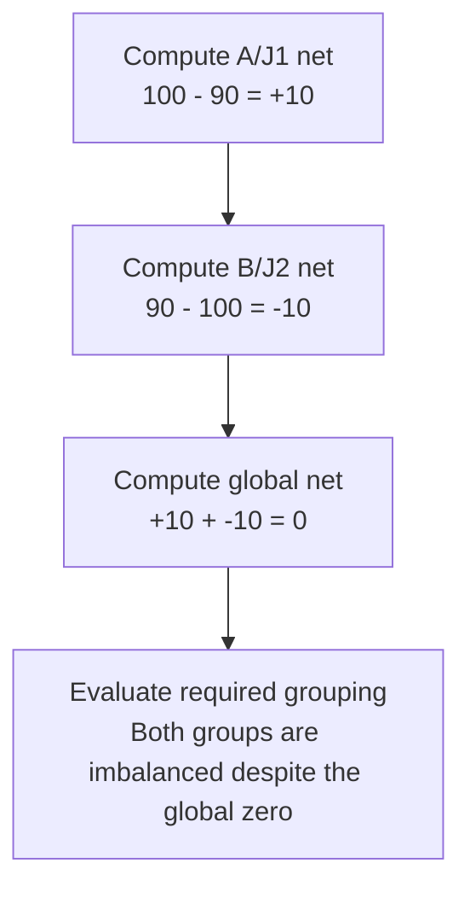

# Worked model: A zero total can hide two invalid journals

This is a solved teaching model, followed by ways to practice it. It is not a report of a newly discovered bug in lucasrouter. Read the full explanation, follow the table, or reconstruct it aloud; switch methods when one exposes a gap that another hides.

## Start with a concrete situation

Group A/J1 has debit100 and credit90. Group B/J2 has debit90 and credit100. Values are exact integer units.

Pause here and write a prediction in one sentence. A prediction is useful even when it is wrong because it gives the explanation something specific to correct. Do not change your original note after reading the result; add a correction beside it.

## Follow the state, one step at a time

| Step | Action or observation | State or consequence |
|---|---|---|
| 1 | Compute A/J1 net | 100 - 90 = +10 |
| 2 | Compute B/J2 net | 90 - 100 = -10 |
| 3 | Compute global net | +10 + -10 = 0 |
| 4 | Evaluate required grouping | Both groups are imbalanced despite the global zero |

**Worked result:** Report both imbalanced groups. The invariant belongs to each organization/journal pair.

Read down the state column without the prose. Then read the prose without the table. The two representations should describe the same mechanism. If an arrow in your mental picture has no corresponding step, identify the assumption you supplied yourself.

## See the same trace as a diagram

Each arrow means the next reasoning step in this teaching trace. It is not automatically a network request, transaction, or object reference. Compare a node with its table row and explain the transition before moving downward.

## Why this result follows

Aggregation can destroy the information needed to judge correctness. Once the two groups are combined, the positive and negative errors cancel numerically. The global result is arithmetically accurate but answers the wrong question. This is why defining the grouping key is as important as choosing the sum operation.

Represent the composite identity without ambiguous delimiter concatenation. The pairs (a|b,c) and (a,b|c) should not collide because a chosen separator also appears inside an opaque identifier. A tuple representation or properly structured key can preserve the two components. The same concern appears in cache identity, scoped record lookup, and command receipts.

Exact integer units keep this teaching example focused on grouping rather than decimal rounding. If accumulated values can exceed safe Number arithmetic, choose an appropriate representation and state the serialization policy. That decision is separate from whether the group itself is authorized to be posted or whether a report can change ledger state.

The read projection can detect inconsistent totals in its input, but it does not implement the posting transaction or prove the data was accepted correctly. A useful explanation names both the arithmetic it establishes and the write-time guarantees it leaves outside the model.

## The tempting explanation that fails

Check only one grand total and treat its zero net as proof that every underlying journal is balanced.

The mistake is useful because it is plausible. A weak exercise simply says the wrong answer is wrong. A stronger one identifies the exact point where it stops matching the fixture. Return to the table and mark that row. If your proposed repair changes a different row, explain why it reaches the same mechanism rather than merely hiding its visible symptom.

## A second worked case

**Change:** Move the credit10 needed by A/J1 into a third unrelated journal. Does the presence of enough credit somewhere in the data repair A/J1?

**Resolution:** No. Entries must satisfy the invariant within the correct journal and organization grouping. Unrelated balancing amounts cannot be borrowed by aggregation.

Compare the first and second cases by naming the changed assumption. Keep the other facts fixed while explaining the difference. This prevents a common learning trap: changing several things at once and crediting the result to whichever change seems most memorable.

## Connect the idea to this repository

The project involves a dispatcher or driver using the dispatch list and driver dialog. Compare this model with the local case **Proof and status disagree**: A report says a stop is delivered while its required proof field is absent. The candidate must distinguish UI form validation from the domain transition and historical-data policy.

The project-specific rule in that case is: A transition must satisfy the chosen status-and-proof contract at its authority boundary.

The connection is an opportunity to compare boundaries, not permission to paste the toy algorithm into application code. Start at the [source map](../README.md). Locate the current caller, representation, validation, and state owner. If the concept is only indirectly relevant, explain the difference; for example, a local projection and a durable transaction may share a reasoning pattern without sharing an implementation.

## Practice by reading, drawing, building, and speaking

For a reading pass, explain one paragraph in your own words and attach it to a row of the trace. For a drawing pass, use boxes for values or owners and arrows for references or events; label what each arrow means so references are not confused with requests. For a building pass, construct the smallest fixture that distinguishes the correct result from the tempting shortcut. Keep it in practice files, not production code.

For a speaking pass, explain the setup and result in ninety seconds without naming a library. Then add the implementation detail that matters. If that detail cannot be connected to an observable consequence, it may not belong in the first explanation. A listener should be able to change one input and understand why your prediction changes or stays the same.

## A short journal entry to keep

Write four connected sentences: I initially predicted __ because __. The worked trace shows __ at step __. My revised rule is __, under assumptions __. I still need __ evidence before claiming __ about the application.

The last sentence matters. Understanding a pure model is useful progress, but it does not automatically verify browser interaction, database isolation, current production behavior, or another person's learning. Return tomorrow with a different fixture and see whether you can reconstruct the mechanism without rereading this page.
