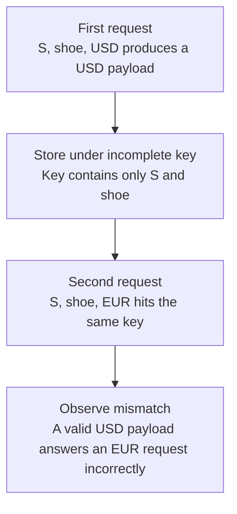

# Worked model: A fast answer to the wrong question

This is a solved teaching model, followed by ways to practice it. It is not a report of a newly discovered bug in lucasrouter. Read the full explanation, follow the table, or reconstruct it aloud; switch methods when one exposes a gap that another hides.

## Start with a concrete situation

Two catalog requests use store S and query shoe, but one requests USD and the other EUR. The cached payload includes currency-specific amounts.

Pause here and write a prediction in one sentence. A prediction is useful even when it is wrong because it gives the explanation something specific to correct. Do not change your original note after reading the result; add a correction beside it.

## Follow the state, one step at a time

| Step | Action or observation | State or consequence |
|---|---|---|
| 1 | First request | S, shoe, USD produces a USD payload |
| 2 | Store under incomplete key | Key contains only S and shoe |
| 3 | Second request | S, shoe, EUR hits the same key |
| 4 | Observe mismatch | A valid USD payload answers an EUR request incorrectly |

**Worked result:** Currency must participate in this cached representation’s identity, or the cached computation must be redesigned to exclude currency-specific output.

Read down the state column without the prose. Then read the prose without the table. The two representations should describe the same mechanism. If an arrow in your mental picture has no corresponding step, identify the assumption you supplied yourself.

## See the same trace as a diagram

Each arrow means the next reasoning step in this teaching trace. It is not automatically a network request, transaction, or object reference. Compare a node with its table row and explain the transition before moving downward.

## Why this result follows

A cache key is a claim that every request represented by that key may safely share one stored result. The fixture disproves that claim because the output changes with currency. The response can be fast, parse correctly, and contain the expected product IDs while still being wrong for the caller.

First identify the cached function's boundary. If currency conversion occurs after retrieving a currency-neutral cached result, currency may not belong in that inner key. If the stored response already contains converted amounts, it does. Adding every available field without understanding the computation can reduce sharing without fixing the underlying representation error.

Normalization also defines equivalence. Trimming and lowercasing a human search query might be the declared policy, while lowercasing an opaque store identifier might merge distinct stores. A good key example includes two requests that should share and two that must not. This makes the intended equivalence relation visible to a reviewer.

Privacy adds another dimension. A personalized or authorized-only representation should not be stored under an anonymous public identity merely because the frontend hides its extra fields. Sharing scope belongs to the data boundary. A high hit rate is a performance observation, not evidence that the shared result is appropriate for every caller.

## The tempting explanation that fails

Use only the most obvious search parameter and assume all other request fields are presentation details.

The mistake is useful because it is plausible. A weak exercise simply says the wrong answer is wrong. A stronger one identifies the exact point where it stops matching the fixture. Return to the table and mark that row. If your proposed repair changes a different row, explain why it reaches the same mechanism rather than merely hiding its visible symptom.

## A second worked case

**Change:** The cached object contains only currency-neutral product IDs; conversion happens afterward. Must the inner key still include currency?

**Resolution:** Not merely because currency exists on the outer request. Inspect the actual cached representation and sharing scope; dimensions belong in the key when they change that result.

Compare the first and second cases by naming the changed assumption. Keep the other facts fixed while explaining the difference. This prevents a common learning trap: changing several things at once and crediting the result to whichever change seems most memorable.

## Connect the idea to this repository

The project involves a dispatcher or driver using the dispatch list and driver dialog. Compare this model with the local case **A list changes underneath a selection**: A dispatcher filters the list while a driver updates one stop. The selected row disappears from the visible list. The UI must keep entity identity distinct from its displayed position.

The project-specific rule in that case is: Selection refers to a stable stop ID; visibility is a separate fact.

The connection is an opportunity to compare boundaries, not permission to paste the toy algorithm into application code. Start at the [source map](../README.md). Locate the current caller, representation, validation, and state owner. If the concept is only indirectly relevant, explain the difference; for example, a local projection and a durable transaction may share a reasoning pattern without sharing an implementation.

## Practice by reading, drawing, building, and speaking

For a reading pass, explain one paragraph in your own words and attach it to a row of the trace. For a drawing pass, use boxes for values or owners and arrows for references or events; label what each arrow means so references are not confused with requests. For a building pass, construct the smallest fixture that distinguishes the correct result from the tempting shortcut. Keep it in practice files, not production code.

For a speaking pass, explain the setup and result in ninety seconds without naming a library. Then add the implementation detail that matters. If that detail cannot be connected to an observable consequence, it may not belong in the first explanation. A listener should be able to change one input and understand why your prediction changes or stays the same.

## A short journal entry to keep

Write four connected sentences: I initially predicted __ because __. The worked trace shows __ at step __. My revised rule is __, under assumptions __. I still need __ evidence before claiming __ about the application.

The last sentence matters. Understanding a pure model is useful progress, but it does not automatically verify browser interaction, database isolation, current production behavior, or another person's learning. Return tomorrow with a different fixture and see whether you can reconstruct the mechanism without rereading this page.
