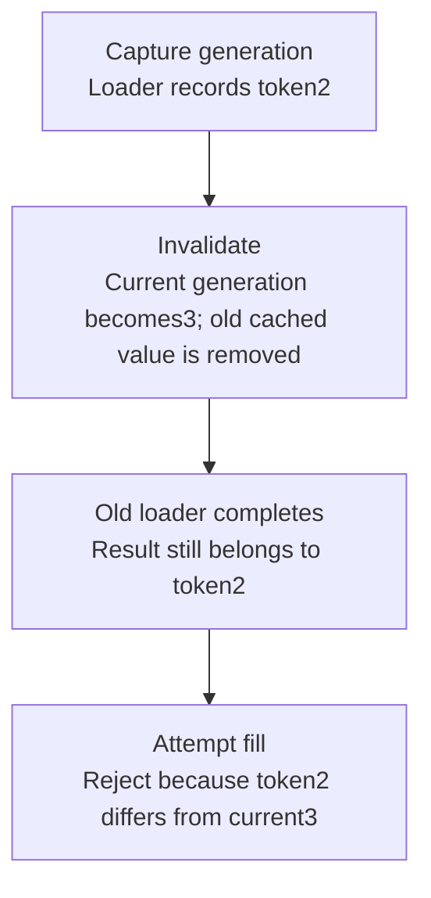

# Worked model: Deletion does not cancel an already-running load

This is a solved teaching model, followed by ways to practice it. It is not a report of a newly discovered bug in lucasrouter. Read the full explanation, follow the table, or reconstruct it aloud; switch methods when one exposes a gap that another hides.

## Start with a concrete situation

A loader starts under generation2. An editor changes the data and invalidates the key, advancing it to generation3. The old loader finishes afterward.

Pause here and write a prediction in one sentence. A prediction is useful even when it is wrong because it gives the explanation something specific to correct. Do not change your original note after reading the result; add a correction beside it.

## Follow the state, one step at a time

| Step | Action or observation | State or consequence |
|---|---|---|
| 1 | Capture generation | Loader records token2 |
| 2 | Invalidate | Current generation becomes3; old cached value is removed |
| 3 | Old loader completes | Result still belongs to token2 |
| 4 | Attempt fill | Reject because token2 differs from current3 |

**Worked result:** The old result cannot repopulate the current generation under this teaching contract.

Read down the state column without the prose. Then read the prose without the table. The two representations should describe the same mechanism. If an arrow in your mental picture has no corresponding step, identify the assumption you supplied yourself.

## See the same trace as a diagram

Each arrow means the next reasoning step in this teaching trace. It is not automatically a network request, transaction, or object reference. Compare a node with its table row and explain the transition before moving downward.

## Why this result follows

Invalidation is often drawn as one action: delete the entry. That picture misses work already in progress. The loader does not disappear just because its future destination was cleared. If it unconditionally writes after the edit, it can recreate exactly the stale entry the invalidation intended to remove.

A generation token makes the relationship explicit. Capture the generation when the load begins, advance it when the key is invalidated, and compare before accepting the fill. The comparison is about whether the load belongs to the current generation, not simply whether an entry is currently absent. An empty cache can still reject a stale result.

The implementation boundary matters when several processes share a cache. A local counter coordinates only the callers that see that counter. If a remote store owns the value and generation, accepting a fill may need an atomic operation there. Otherwise a race can appear between checking the generation and writing the value. The in-memory model is an executable policy explanation, not a distributed coordination proof.

The reproduction should keep the first loader unresolved, invalidate, then resolve it. A test that finishes the loader before invalidating verifies ordinary deletion but misses the late-fill race. Changing the order is what makes the test discriminating.

## The tempting explanation that fails

After invalidation, accept any arriving fill merely because the cache entry is absent.

The mistake is useful because it is plausible. A weak exercise simply says the wrong answer is wrong. A stronger one identifies the exact point where it stops matching the fixture. Return to the table and mark that row. If your proposed repair changes a different row, explain why it reaches the same mechanism rather than merely hiding its visible symptom.

## A second worked case

**Change:** Invalidate a key that has no current value but does have an in-flight loader. Should the generation still advance?

**Resolution:** Yes under this policy. Invalidation concerns outstanding work as well as a stored entry; the pending old loader must become ineligible.

Compare the first and second cases by naming the changed assumption. Keep the other facts fixed while explaining the difference. This prevents a common learning trap: changing several things at once and crediting the result to whichever change seems most memorable.

## Connect the idea to this repository

The project involves a dispatcher or driver using the dispatch list and driver dialog. Compare this model with the local case **Undo arrives after newer work**: A stop is marked delivered, later marked failed, and then an older undo action arrives. This interview uses a synthetic revision contract, not an assertion that the current store has revisions.

The project-specific rule in that case is: An old undo must not overwrite a newer accepted change.

The connection is an opportunity to compare boundaries, not permission to paste the toy algorithm into application code. Start at the [source map](../README.md). Locate the current caller, representation, validation, and state owner. If the concept is only indirectly relevant, explain the difference; for example, a local projection and a durable transaction may share a reasoning pattern without sharing an implementation.

## Practice by reading, drawing, building, and speaking

For a reading pass, explain one paragraph in your own words and attach it to a row of the trace. For a drawing pass, use boxes for values or owners and arrows for references or events; label what each arrow means so references are not confused with requests. For a building pass, construct the smallest fixture that distinguishes the correct result from the tempting shortcut. Keep it in practice files, not production code.

For a speaking pass, explain the setup and result in ninety seconds without naming a library. Then add the implementation detail that matters. If that detail cannot be connected to an observable consequence, it may not belong in the first explanation. A listener should be able to change one input and understand why your prediction changes or stays the same.

## A short journal entry to keep

Write four connected sentences: I initially predicted __ because __. The worked trace shows __ at step __. My revised rule is __, under assumptions __. I still need __ evidence before claiming __ about the application.

The last sentence matters. Understanding a pure model is useful progress, but it does not automatically verify browser interaction, database isolation, current production behavior, or another person's learning. Return tomorrow with a different fixture and see whether you can reconstruct the mechanism without rereading this page.
