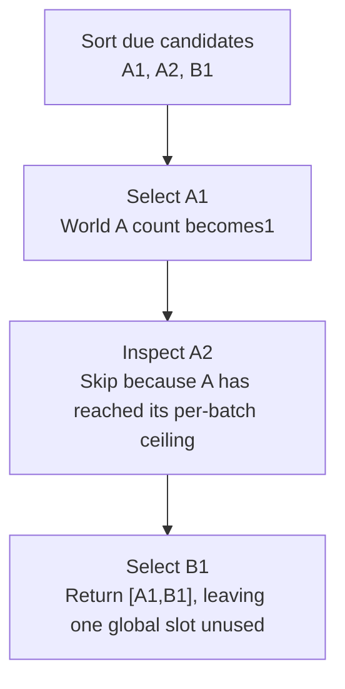

# Worked model: A quota is not a long-term fairness proof

This is a solved teaching model, followed by ways to practice it. It is not a report of a newly discovered bug in lucasrouter. Read the full explanation, follow the table, or reconstruct it aloud; switch methods when one exposes a gap that another hides.

## Start with a concrete situation

Due events are A1 at1, A2 at2, and B1 at3. Global batch limit is3 and the per-world limit is1.

Pause here and write a prediction in one sentence. A prediction is useful even when it is wrong because it gives the explanation something specific to correct. Do not change your original note after reading the result; add a correction beside it.

## Follow the state, one step at a time

| Step | Action or observation | State or consequence |
|---|---|---|
| 1 | Sort due candidates | A1, A2, B1 |
| 2 | Select A1 | World A count becomes1 |
| 3 | Inspect A2 | Skip because A has reached its per-batch ceiling |
| 4 | Select B1 | Return [A1,B1], leaving one global slot unused |

**Worked result:** The batch contains two events. Underfilling is allowed because the per-world rule is part of the contract.

Read down the state column without the prose. Then read the prose without the table. The two representations should describe the same mechanism. If an arrow in your mental picture has no corresponding step, identify the assumption you supplied yourself.

## See the same trace as a diagram

Each arrow means the next reasoning step in this teaching trace. It is not automatically a network request, transaction, or object reference. Compare a node with its table row and explain the transition before moving downward.

## Why this result follows

A global limit bounds total output from one call. A per-world ceiling controls how much of that output one world can occupy. These constraints answer different questions. In the fixture, filling the third slot with A2 would violate the world ceiling even though it appears to improve utilization.

Now reduce the global limit to one and repeat the process while A always has the earliest event. A per-batch ceiling of one does not prevent A from occupying the only slot every time. Long-term fairness may require a persistent rotation, age policy, or other scheduling rule. It does not follow from one batch satisfying its limits.

Selection also differs from claiming. Two workers can read the same snapshot and select A1. A deterministic ordering makes their plans reproducible but does not establish exclusive ownership of the effect. Transactional claiming, conditional transitions, or durable idempotency belongs to a different boundary and needs a different test.

The useful learning artifact is two traces: one showing the within-batch quota and another showing a repeated-batch starvation possibility. Together they prevent the phrase fair batching from hiding a stronger unproved claim. If the product intentionally permits borrowing unused quota, write a new policy and new examples rather than silently changing the selector.

## The tempting explanation that fails

Call a single-batch per-world limit a guarantee that every world eventually progresses.

The mistake is useful because it is plausible. A weak exercise simply says the wrong answer is wrong. A stronger one identifies the exact point where it stops matching the fixture. Return to the table and mark that row. If your proposed repair changes a different row, explain why it reaches the same mechanism rather than merely hiding its visible symptom.

## A second worked case

**Change:** Add C1 at4 with the same limits. Which third event may fill the batch, and why is it different from accepting A2?

**Resolution:** C1 may be selected because world C has not used its quota. A2 remains excluded because world A already has one selected event.

Compare the first and second cases by naming the changed assumption. Keep the other facts fixed while explaining the difference. This prevents a common learning trap: changing several things at once and crediting the result to whichever change seems most memorable.

## Connect the idea to this repository

The project involves a dispatcher or driver using the dispatch list and driver dialog. Compare this model with the local case **A list changes underneath a selection**: A dispatcher filters the list while a driver updates one stop. The selected row disappears from the visible list. The UI must keep entity identity distinct from its displayed position.

The project-specific rule in that case is: Selection refers to a stable stop ID; visibility is a separate fact.

The connection is an opportunity to compare boundaries, not permission to paste the toy algorithm into application code. Start at the [source map](../README.md). Locate the current caller, representation, validation, and state owner. If the concept is only indirectly relevant, explain the difference; for example, a local projection and a durable transaction may share a reasoning pattern without sharing an implementation.

## Practice by reading, drawing, building, and speaking

For a reading pass, explain one paragraph in your own words and attach it to a row of the trace. For a drawing pass, use boxes for values or owners and arrows for references or events; label what each arrow means so references are not confused with requests. For a building pass, construct the smallest fixture that distinguishes the correct result from the tempting shortcut. Keep it in practice files, not production code.

For a speaking pass, explain the setup and result in ninety seconds without naming a library. Then add the implementation detail that matters. If that detail cannot be connected to an observable consequence, it may not belong in the first explanation. A listener should be able to change one input and understand why your prediction changes or stays the same.

## A short journal entry to keep

Write four connected sentences: I initially predicted __ because __. The worked trace shows __ at step __. My revised rule is __, under assumptions __. I still need __ evidence before claiming __ about the application.

The last sentence matters. Understanding a pure model is useful progress, but it does not automatically verify browser interaction, database isolation, current production behavior, or another person's learning. Return tomorrow with a different fixture and see whether you can reconstruct the mechanism without rereading this page.
