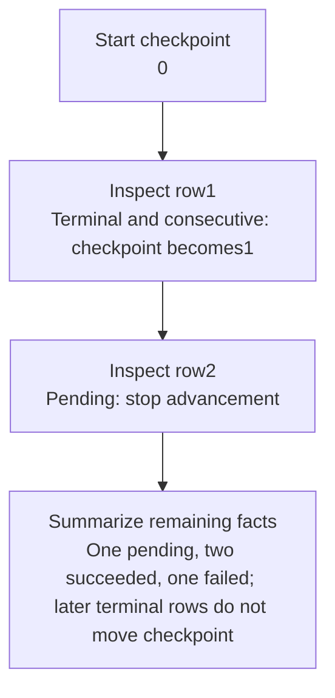

# Worked model: Row three finishing does not finish row two

This is a solved teaching model, followed by ways to practice it. It is not a report of a newly discovered bug in lucasrouter. Read the full explanation, follow the table, or reconstruct it aloud; switch methods when one exposes a gap that another hides.

## Start with a concrete situation

Import rows are 1 succeeded, 2 pending, 3 succeeded, and 4 failed. Failed is terminal under this exercise’s policy.

Pause here and write a prediction in one sentence. A prediction is useful even when it is wrong because it gives the explanation something specific to correct. Do not change your original note after reading the result; add a correction beside it.

## Follow the state, one step at a time

| Step | Action or observation | State or consequence |
|---|---|---|
| 1 | Start checkpoint | 0 |
| 2 | Inspect row1 | Terminal and consecutive: checkpoint becomes1 |
| 3 | Inspect row2 | Pending: stop advancement |
| 4 | Summarize remaining facts | One pending, two succeeded, one failed; later terminal rows do not move checkpoint |

**Worked result:** The contiguous checkpoint is1, and the job is not complete while row2 remains pending.

Read down the state column without the prose. Then read the prose without the table. The two representations should describe the same mechanism. If an arrow in your mental picture has no corresponding step, identify the assumption you supplied yourself.

## See the same trace as a diagram

Each arrow means the next reasoning step in this teaching trace. It is not automatically a network request, transaction, or object reference. Compare a node with its table row and explain the transition before moving downward.

## Why this result follows

A maximum processed row is not the same as a contiguous completed prefix. The maximum tells us that some later position was processed. It says nothing about every preceding position. This difference matters when a resume algorithm decides where to begin after a restart.

The checkpoint trace advances only when the next expected row exists and is terminal. A missing row number also stops it under this policy. Treating an absent row as successful work would hide a data-integrity question. The real application might guarantee contiguous row creation, but that guarantee must be located rather than assumed by a reporting helper.

Counts and completion answer other useful questions. A job with no pending rows can be terminal while containing failures. Calling it fully successful would mislead a user who needs to repair rejected data. Report the separate outcomes and retain stable source-row identity so the user can locate the record even if a filtered preview changes display positions.

The planner still does not claim rows or make their side effects atomic. A worker can create a lead and crash before saving its row result. On retry, correct selection alone does not prevent duplication. Keep planning, progress reporting, and durable processing as separate mechanisms in both the explanation and the tests.

## The tempting explanation that fails

Resume after the maximum successful row and silently skip an earlier pending row.

The mistake is useful because it is plausible. A weak exercise simply says the wrong answer is wrong. A stronger one identifies the exact point where it stops matching the fixture. Return to the table and mark that row. If your proposed repair changes a different row, explain why it reaches the same mechanism rather than merely hiding its visible symptom.

## A second worked case

**Change:** Remove row2 entirely while rows1 and3 are terminal. What is the checkpoint, and what new investigation should be raised?

**Resolution:** It remains1. The gap should prompt a check of row-creation integrity or the snapshot query; it is not evidence that row2 succeeded.

Compare the first and second cases by naming the changed assumption. Keep the other facts fixed while explaining the difference. This prevents a common learning trap: changing several things at once and crediting the result to whichever change seems most memorable.

## Connect the idea to this repository

The project involves a dispatcher or driver using the dispatch list and driver dialog. Compare this model with the local case **Proof and status disagree**: A report says a stop is delivered while its required proof field is absent. The candidate must distinguish UI form validation from the domain transition and historical-data policy.

The project-specific rule in that case is: A transition must satisfy the chosen status-and-proof contract at its authority boundary.

The connection is an opportunity to compare boundaries, not permission to paste the toy algorithm into application code. Start at the [source map](../README.md). Locate the current caller, representation, validation, and state owner. If the concept is only indirectly relevant, explain the difference; for example, a local projection and a durable transaction may share a reasoning pattern without sharing an implementation.

## Practice by reading, drawing, building, and speaking

For a reading pass, explain one paragraph in your own words and attach it to a row of the trace. For a drawing pass, use boxes for values or owners and arrows for references or events; label what each arrow means so references are not confused with requests. For a building pass, construct the smallest fixture that distinguishes the correct result from the tempting shortcut. Keep it in practice files, not production code.

For a speaking pass, explain the setup and result in ninety seconds without naming a library. Then add the implementation detail that matters. If that detail cannot be connected to an observable consequence, it may not belong in the first explanation. A listener should be able to change one input and understand why your prediction changes or stays the same.

## A short journal entry to keep

Write four connected sentences: I initially predicted __ because __. The worked trace shows __ at step __. My revised rule is __, under assumptions __. I still need __ evidence before claiming __ about the application.

The last sentence matters. Understanding a pure model is useful progress, but it does not automatically verify browser interaction, database isolation, current production behavior, or another person's learning. Return tomorrow with a different fixture and see whether you can reconstruct the mechanism without rereading this page.
