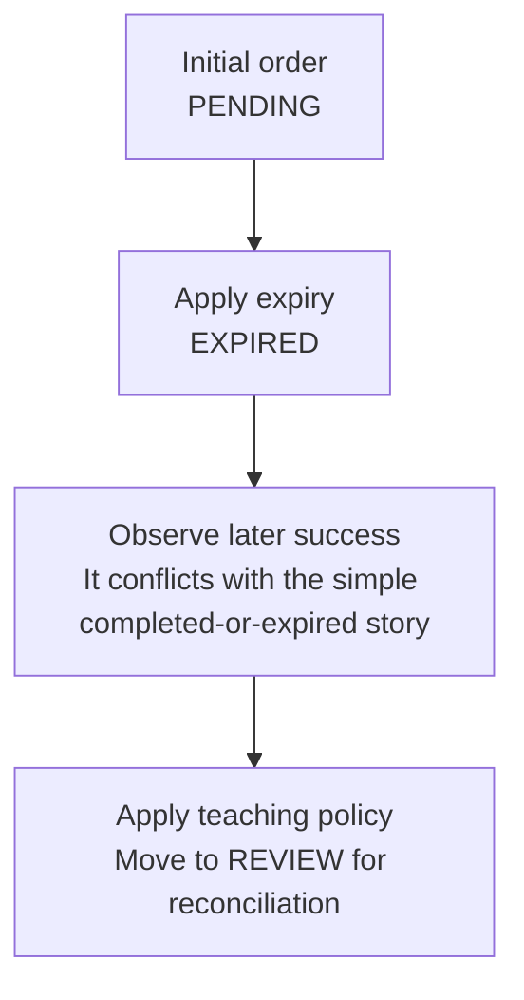

# Worked model: Late success after expiry needs a named policy

This is a solved teaching model, followed by ways to practice it. It is not a report of a newly discovered bug in lucasrouter. Read the full explanation, follow the table, or reconstruct it aloud; switch methods when one exposes a gap that another hides.

## Start with a concrete situation

An order is PENDING, then an expiry transition makes it EXPIRED. A later authenticated, normalized success event arrives.

Pause here and write a prediction in one sentence. A prediction is useful even when it is wrong because it gives the explanation something specific to correct. Do not change your original note after reading the result; add a correction beside it.

## Follow the state, one step at a time

| Step | Action or observation | State or consequence |
|---|---|---|
| 1 | Initial order | PENDING |
| 2 | Apply expiry | EXPIRED |
| 3 | Observe later success | It conflicts with the simple completed-or-expired story |
| 4 | Apply teaching policy | Move to REVIEW for reconciliation |

**Worked result:** The model exposes a review state. It does not silently assume whether inventory or external money can be reconciled automatically.

Read down the state column without the prose. Then read the prose without the table. The two representations should describe the same mechanism. If an arrow in your mental picture has no corresponding step, identify the assumption you supplied yourself.

## See the same trace as a diagram

Each arrow means the next reasoning step in this teaching trace. It is not automatically a network request, transaction, or object reference. Compare a node with its table row and explain the transition before moving downward.

## Why this result follows

A status transition table can make policy explicit, but it cannot invent the missing business facts. The late event may represent an external action that occurred before the local expiry observation or a delayed delivery after it. Arrival order alone does not necessarily reveal the order of authoritative effects.

The teaching policy chooses REVIEW so the conflict stays visible. A real service must decide how provider evidence, inventory availability, and customer communication determine the next action. The model does not verify a webhook signature, fetch provider status, refund a payment, or reclaim capacity. Those are distinct operations that should not be hidden behind a single status assignment.

Duplicate event identity is another axis. Receiving the same event twice should not create two effects under a deduplicated contract, but a different later event can still require a new transition. A set of seen IDs explains the in-memory decision. Durable deduplication needs its identity and effect to be coordinated at the actual persistence boundary.

A strong worked example keeps the state before each event, the event identity, and the resulting state in separate columns. That makes it possible to distinguish an ignored replay from a newly observed contradiction. It also gives the interface a truthful outcome to display instead of turning uncertainty into a false success or failure.

## The tempting explanation that fails

Convert every success-shaped event directly into confirmed inventory regardless of the current state or authoritative evidence.

The mistake is useful because it is plausible. A weak exercise simply says the wrong answer is wrong. A stronger one identifies the exact point where it stops matching the fixture. Return to the table and mark that row. If your proposed repair changes a different row, explain why it reaches the same mechanism rather than merely hiding its visible symptom.

## A second worked case

**Change:** Deliver the exact same success event twice after it has already been accepted. Is the second delivery a new order?

**Resolution:** No under the stated event-identity policy. It is a replay of the same observation. The real effect boundary must enforce that distinction durably if duplicate effects matter.

Compare the first and second cases by naming the changed assumption. Keep the other facts fixed while explaining the difference. This prevents a common learning trap: changing several things at once and crediting the result to whichever change seems most memorable.

## Connect the idea to this repository

The project involves a dispatcher or driver using the dispatch list and driver dialog. Compare this model with the local case **Undo arrives after newer work**: A stop is marked delivered, later marked failed, and then an older undo action arrives. This interview uses a synthetic revision contract, not an assertion that the current store has revisions.

The project-specific rule in that case is: An old undo must not overwrite a newer accepted change.

The connection is an opportunity to compare boundaries, not permission to paste the toy algorithm into application code. Start at the [source map](../README.md). Locate the current caller, representation, validation, and state owner. If the concept is only indirectly relevant, explain the difference; for example, a local projection and a durable transaction may share a reasoning pattern without sharing an implementation.

## Practice by reading, drawing, building, and speaking

For a reading pass, explain one paragraph in your own words and attach it to a row of the trace. For a drawing pass, use boxes for values or owners and arrows for references or events; label what each arrow means so references are not confused with requests. For a building pass, construct the smallest fixture that distinguishes the correct result from the tempting shortcut. Keep it in practice files, not production code.

For a speaking pass, explain the setup and result in ninety seconds without naming a library. Then add the implementation detail that matters. If that detail cannot be connected to an observable consequence, it may not belong in the first explanation. A listener should be able to change one input and understand why your prediction changes or stays the same.

## A short journal entry to keep

Write four connected sentences: I initially predicted __ because __. The worked trace shows __ at step __. My revised rule is __, under assumptions __. I still need __ evidence before claiming __ about the application.

The last sentence matters. Understanding a pure model is useful progress, but it does not automatically verify browser interaction, database isolation, current production behavior, or another person's learning. Return tomorrow with a different fixture and see whether you can reconstruct the mechanism without rereading this page.
