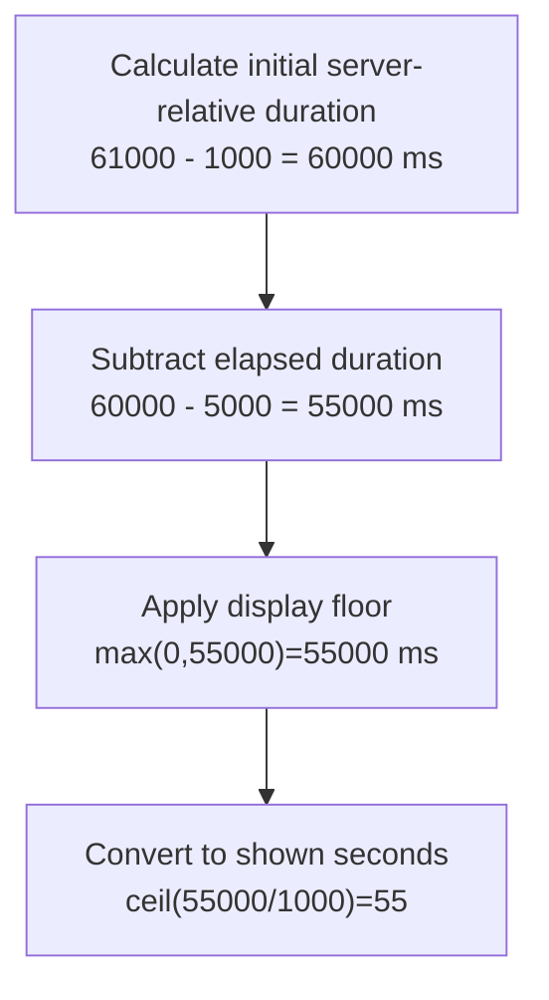

# Worked model: A display countdown is not the inventory authority

This is a solved teaching model, followed by ways to practice it. It is not a report of a newly discovered bug in lucasrouter. Read the full explanation, follow the table, or reconstruct it aloud; switch methods when one exposes a gap that another hides.

## Start with a concrete situation

At synchronization, serverNow=1000 and expiry=61000 milliseconds. The client measures elapsed=5000 milliseconds. Its local wall clock then changes.

Pause here and write a prediction in one sentence. A prediction is useful even when it is wrong because it gives the explanation something specific to correct. Do not change your original note after reading the result; add a correction beside it.

## Follow the state, one step at a time

| Step | Action or observation | State or consequence |
|---|---|---|
| 1 | Calculate initial server-relative duration | 61000 - 1000 = 60000 ms |
| 2 | Subtract elapsed duration | 60000 - 5000 = 55000 ms |
| 3 | Apply display floor | max(0,55000)=55000 ms |
| 4 | Convert to shown seconds | ceil(55000/1000)=55 |

**Worked result:** The display estimate is55 seconds. Editing the client wall clock does not extend the server-owned hold.

Read down the state column without the prose. Then read the prose without the table. The two representations should describe the same mechanism. If an arrow in your mental picture has no corresponding step, identify the assumption you supplied yourself.

## See the same trace as a diagram

Each arrow means the next reasoning step in this teaching trace. It is not automatically a network request, transaction, or object reference. Compare a node with its table row and explain the transition before moving downward.

## Why this result follows

Three concepts are easy to collapse into one word, time. Server wall time defines the authoritative expiry in this example. Client wall time can differ or be edited. Elapsed time since synchronization estimates how long the client has waited. Subtracting elapsed duration from a server-relative remaining duration avoids treating a local wall-clock jump as a new reservation.

The estimate still has limits. Network delay, suspension, and the clock used for elapsed measurement affect how accurately the display follows the server. A resynchronization policy may be needed. The server must independently check whether the hold is still valid when a protected operation occurs; a zero or positive number on the screen does not itself release or reserve inventory.

Rounding is a visible contract. With one millisecond left, a ceiling-based display shows one second, while the underlying remaining duration is nearly zero. At exactly zero, the display is expired. Write threshold examples instead of relying on a screenshot taken at an arbitrary instant.

Tests can inject the three numeric values directly. No real waiting or system-clock change is necessary to prove this arithmetic. A browser test is still needed to check actual rendering and update behavior, and a server test is needed for the authoritative expiry decision.

## The tempting explanation that fails

Calculate every deadline only from the user’s editable wall clock and treat the displayed value as proof of a valid reservation.

The mistake is useful because it is plausible. A weak exercise simply says the wrong answer is wrong. A stronger one identifies the exact point where it stops matching the fixture. Return to the table and mark that row. If your proposed repair changes a different row, explain why it reaches the same mechanism rather than merely hiding its visible symptom.

## A second worked case

**Change:** Set elapsed=60000 and then60001. What values should remain after applying the nonnegative floor?

**Resolution:** Both yield zero remaining duration; the second case must not display a negative countdown. This display rule does not decide server-side cleanup timing.

Compare the first and second cases by naming the changed assumption. Keep the other facts fixed while explaining the difference. This prevents a common learning trap: changing several things at once and crediting the result to whichever change seems most memorable.

## Connect the idea to this repository

The project involves a dispatcher or driver using the dispatch list and driver dialog. Compare this model with the local case **Undo arrives after newer work**: A stop is marked delivered, later marked failed, and then an older undo action arrives. This interview uses a synthetic revision contract, not an assertion that the current store has revisions.

The project-specific rule in that case is: An old undo must not overwrite a newer accepted change.

The connection is an opportunity to compare boundaries, not permission to paste the toy algorithm into application code. Start at the [source map](../README.md). Locate the current caller, representation, validation, and state owner. If the concept is only indirectly relevant, explain the difference; for example, a local projection and a durable transaction may share a reasoning pattern without sharing an implementation.

## Practice by reading, drawing, building, and speaking

For a reading pass, explain one paragraph in your own words and attach it to a row of the trace. For a drawing pass, use boxes for values or owners and arrows for references or events; label what each arrow means so references are not confused with requests. For a building pass, construct the smallest fixture that distinguishes the correct result from the tempting shortcut. Keep it in practice files, not production code.

For a speaking pass, explain the setup and result in ninety seconds without naming a library. Then add the implementation detail that matters. If that detail cannot be connected to an observable consequence, it may not belong in the first explanation. A listener should be able to change one input and understand why your prediction changes or stays the same.

## A short journal entry to keep

Write four connected sentences: I initially predicted __ because __. The worked trace shows __ at step __. My revised rule is __, under assumptions __. I still need __ evidence before claiming __ about the application.

The last sentence matters. Understanding a pure model is useful progress, but it does not automatically verify browser interaction, database isolation, current production behavior, or another person's learning. Return tomorrow with a different fixture and see whether you can reconstruct the mechanism without rereading this page.
