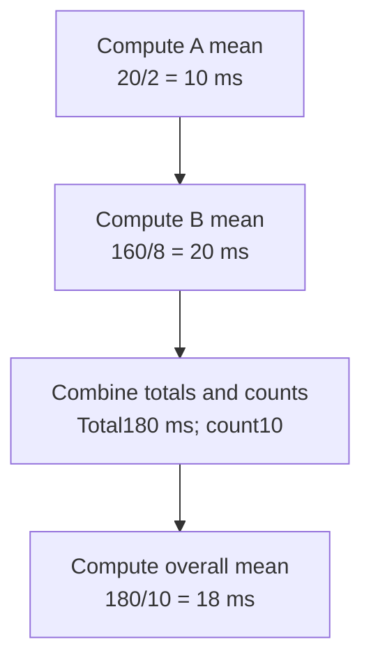

# Worked model: Averages must be weighted by what was counted

This is a solved teaching model, followed by ways to practice it. It is not a report of a newly discovered bug in lucasrouter. Read the full explanation, follow the table, or reconstruct it aloud; switch methods when one exposes a gap that another hides.

## Start with a concrete situation

Group A has two requests totaling20 ms. Group B has eight requests totaling160 ms. Compute the combined mean.

Pause here and write a prediction in one sentence. A prediction is useful even when it is wrong because it gives the explanation something specific to correct. Do not change your original note after reading the result; add a correction beside it.

## Follow the state, one step at a time

| Step | Action or observation | State or consequence |
|---|---|---|
| 1 | Compute A mean | 20/2 = 10 ms |
| 2 | Compute B mean | 160/8 = 20 ms |
| 3 | Combine totals and counts | Total180 ms; count10 |
| 4 | Compute overall mean | 180/10 = 18 ms |

**Worked result:** The overall mean is18 ms. Averaging the two group means gives15 ms and weights the groups incorrectly.

Read down the state column without the prose. Then read the prose without the table. The two representations should describe the same mechanism. If an arrow in your mental picture has no corresponding step, identify the assumption you supplied yourself.

## See the same trace as a diagram

Each arrow means the next reasoning step in this teaching trace. It is not automatically a network request, transaction, or object reference. Compare a node with its table row and explain the transition before moving downward.

## Why this result follows

A mean is a relationship between a sum and the number of observations represented by that sum. When groups have different sizes, their means do not carry equal weight in the combined population. Retaining count and total preserves enough information to combine them correctly.

The same lesson applies when reporting success rates or evaluation metrics. Define what the denominator counts before calculating the ratio. A per-job average and a per-row average can both be valid descriptions while answering different questions. The error comes from substituting one for the other without naming the change.

Do not infer percentiles from these totals. Count, sum, and maximum do not preserve the full distribution needed to reconstruct a percentile. A report can truthfully provide a mean and maximum while stating that p95 is unavailable from the retained data. Inventing a percentile from the mean would make the dashboard look more complete at the cost of correctness.

Labels also affect meaning and cost. A normalized route label groups comparable requests; a raw URL containing a unique identifier can create an unbounded collection of labels. The pure aggregation lesson does not install instrumentation or prove that the events were captured completely. It tells us how to combine a validated sample once its scope is defined.

## The tempting explanation that fails

Average group means without weighting by their observation counts, then label the result the mean of all requests.

The mistake is useful because it is plausible. A weak exercise simply says the wrong answer is wrong. A stronger one identifies the exact point where it stops matching the fixture. Return to the table and mark that row. If your proposed repair changes a different row, explain why it reaches the same mechanism rather than merely hiding its visible symptom.

## A second worked case

**Change:** Group C contains zero requests. Should its mean contribute zero as another equally weighted group to the overall mean?

**Resolution:** No. It contributes zero count and zero duration to the combined totals. Empty-group display policy is separate from adding an invented observation.

Compare the first and second cases by naming the changed assumption. Keep the other facts fixed while explaining the difference. This prevents a common learning trap: changing several things at once and crediting the result to whichever change seems most memorable.

## Connect the idea to this repository

The project involves a dispatcher or driver using the dispatch list and driver dialog. Compare this model with the local case **Proof and status disagree**: A report says a stop is delivered while its required proof field is absent. The candidate must distinguish UI form validation from the domain transition and historical-data policy.

The project-specific rule in that case is: A transition must satisfy the chosen status-and-proof contract at its authority boundary.

The connection is an opportunity to compare boundaries, not permission to paste the toy algorithm into application code. Start at the [source map](../README.md). Locate the current caller, representation, validation, and state owner. If the concept is only indirectly relevant, explain the difference; for example, a local projection and a durable transaction may share a reasoning pattern without sharing an implementation.

## Practice by reading, drawing, building, and speaking

For a reading pass, explain one paragraph in your own words and attach it to a row of the trace. For a drawing pass, use boxes for values or owners and arrows for references or events; label what each arrow means so references are not confused with requests. For a building pass, construct the smallest fixture that distinguishes the correct result from the tempting shortcut. Keep it in practice files, not production code.

For a speaking pass, explain the setup and result in ninety seconds without naming a library. Then add the implementation detail that matters. If that detail cannot be connected to an observable consequence, it may not belong in the first explanation. A listener should be able to change one input and understand why your prediction changes or stays the same.

## A short journal entry to keep

Write four connected sentences: I initially predicted __ because __. The worked trace shows __ at step __. My revised rule is __, under assumptions __. I still need __ evidence before claiming __ about the application.

The last sentence matters. Understanding a pure model is useful progress, but it does not automatically verify browser interaction, database isolation, current production behavior, or another person's learning. Return tomorrow with a different fixture and see whether you can reconstruct the mechanism without rereading this page.
