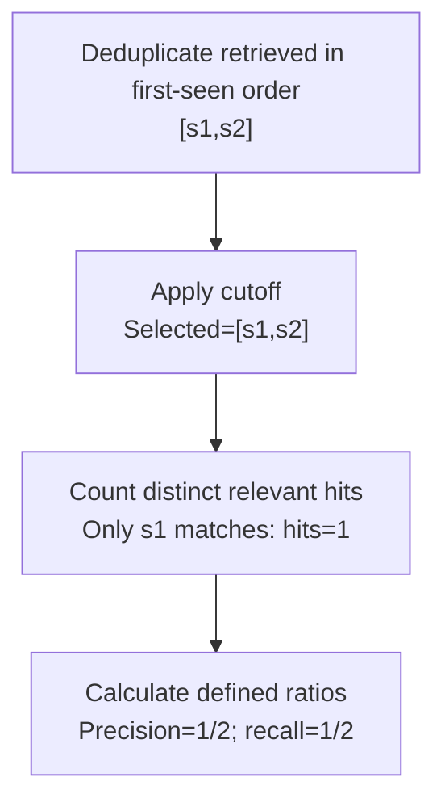

# Worked model: One repeated relevant item is not three independent hits

This is a solved teaching model, followed by ways to practice it. It is not a report of a newly discovered bug in lucasrouter. Read the full explanation, follow the table, or reconstruct it aloud; switch methods when one exposes a gap that another hides.

## Start with a concrete situation

Retrieved IDs are [s1,s1,s2]. Relevant IDs are [s1,s3]. The teaching metric deduplicates retrieved IDs before taking at most k=3.

Pause here and write a prediction in one sentence. A prediction is useful even when it is wrong because it gives the explanation something specific to correct. Do not change your original note after reading the result; add a correction beside it.

## Follow the state, one step at a time

| Step | Action or observation | State or consequence |
|---|---|---|
| 1 | Deduplicate retrieved in first-seen order | [s1,s2] |
| 2 | Apply cutoff | Selected=[s1,s2] |
| 3 | Count distinct relevant hits | Only s1 matches: hits=1 |
| 4 | Calculate defined ratios | Precision=1/2; recall=1/2 |

**Worked result:** Both ratios are0.5 under this explicitly defined metric. Repeating s1 does not inflate the hit count.

Read down the state column without the prose. Then read the prose without the table. The two representations should describe the same mechanism. If an arrow in your mental picture has no corresponding step, identify the assumption you supplied yourself.

## See the same trace as a diagram

Each arrow means the next reasoning step in this teaching trace. It is not automatically a network request, transaction, or object reference. Compare a node with its table row and explain the transition before moving downward.

## Why this result follows

Metric names can sound precise while leaving important choices unstated. Does a duplicate occupy a returned slot? Is precision divided by k or by the number actually selected? What happens when the relevant set is empty? Write the definition before computing the number so readers can reproduce it and compare it with another metric honestly.

This exercise chooses a distinct-item policy. It preserves the first occurrence of each retrieved ID, applies the cutoff, counts membership in the relevant set, and uses the actual selected count as the precision denominator. Other evaluation protocols can make different choices. The worked result should not be labeled as a universal definition when the policy differs.

The number also depends on the reference labels. If the relevant set is incomplete or incorrect, the calculated ratio can be internally consistent while poorly representing retrieval usefulness. A chunk can be authorized yet irrelevant, relevant yet insufficient to support an answer, or correctly retrieved but misused by a generator. Those distinctions require different observations.

The useful transfer is disciplined measurement. Keep identity, normalization, cutoff, denominator, and label source visible. Then compare changed fixtures one at a time. A score increase produced only by duplicate representation is a warning that the measurement may be rewarding a shortcut rather than the intended behavior.

## The tempting explanation that fails

Count every repeated relevant token as a fresh hit and describe the result as improved retrieval quality.

The mistake is useful because it is plausible. A weak exercise simply says the wrong answer is wrong. A stronger one identifies the exact point where it stops matching the fixture. Return to the table and mark that row. If your proposed repair changes a different row, explain why it reaches the same mechanism rather than merely hiding its visible symptom.

## A second worked case

**Change:** Set retrieved=[] while relevant still contains two IDs. Then keep a nonempty retrieval but set relevant=[] under a policy that returns zero for empty denominators.

**Resolution:** The empty retrieval has precision0 and recall0. With an empty relevant set, this teaching policy returns recall0; the report should state that convention instead of implying a meaningful completeness measurement.

Compare the first and second cases by naming the changed assumption. Keep the other facts fixed while explaining the difference. This prevents a common learning trap: changing several things at once and crediting the result to whichever change seems most memorable.

## Connect the idea to this repository

The project involves a dispatcher or driver using the dispatch list and driver dialog. Compare this model with the local case **A list changes underneath a selection**: A dispatcher filters the list while a driver updates one stop. The selected row disappears from the visible list. The UI must keep entity identity distinct from its displayed position.

The project-specific rule in that case is: Selection refers to a stable stop ID; visibility is a separate fact.

The connection is an opportunity to compare boundaries, not permission to paste the toy algorithm into application code. Start at the [source map](../README.md). Locate the current caller, representation, validation, and state owner. If the concept is only indirectly relevant, explain the difference; for example, a local projection and a durable transaction may share a reasoning pattern without sharing an implementation.

## Practice by reading, drawing, building, and speaking

For a reading pass, explain one paragraph in your own words and attach it to a row of the trace. For a drawing pass, use boxes for values or owners and arrows for references or events; label what each arrow means so references are not confused with requests. For a building pass, construct the smallest fixture that distinguishes the correct result from the tempting shortcut. Keep it in practice files, not production code.

For a speaking pass, explain the setup and result in ninety seconds without naming a library. Then add the implementation detail that matters. If that detail cannot be connected to an observable consequence, it may not belong in the first explanation. A listener should be able to change one input and understand why your prediction changes or stays the same.

## A short journal entry to keep

Write four connected sentences: I initially predicted __ because __. The worked trace shows __ at step __. My revised rule is __, under assumptions __. I still need __ evidence before claiming __ about the application.

The last sentence matters. Understanding a pure model is useful progress, but it does not automatically verify browser interaction, database isolation, current production behavior, or another person's learning. Return tomorrow with a different fixture and see whether you can reconstruct the mechanism without rereading this page.
