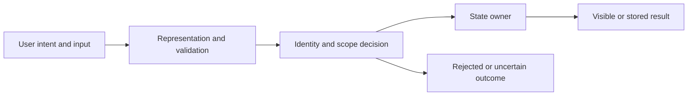

# Drawing, speaking, and hands-on workshop 05

Case: **Keyboard focus loses its owner**. Use this when a long paragraph is not enough, or after reading to test whether you can reconstruct the mechanism another way. You do not need to identify as a particular kind of learner. These are complementary activities, and you can switch between them within one session.

## A. Build a tabletop trace

Write the fixture on paper: **Opener S1 disappears while dialog is open; user presses Escape.**. Use a separate card or row for each entity, operation, or state that can change independently. Label identity and scope explicitly. A card is not automatically a database row; write what it represents.

Place the rule beside the cards: **Closing a dialog should leave focus at a meaningful available control.**. Move or update one card per event or decision. After each move, say which facts changed and which stayed true. If a value is shared by reference, draw two arrows to one card rather than drawing two independent copies. If an event arrives later, place it on a timeline rather than pretending arrival order is a field value.

## B. Read this boundary diagram as a question

This is a teaching map, not an asserted architecture diagram of the application. Cross out boxes that do not belong to the actual interaction and split any box that hides two owners. Label an arrow as an object reference, function call, network request, or persisted transition. Different arrow meanings require different evidence.

For this project, investigate the store action and its persistence boundary. The visible surface is the dispatch list and driver dialog. Mark where route and driver identity is known, requested, or trusted. Those labels can reveal a missing boundary even before you write code.

## C. Compare the correct path with the shortcut

The worked result is: Use the current native-dialog behavior as the starting point, then specify a surviving fallback. Verify keyboard order in a browser; a pure next-target function cannot prove actual focus movement.

The shortcut to challenge is: Choose an arbitrary DOM node or assert focus behavior with only an array unit test.

Draw the shortcut's path in a second color or on a separate line. Find the first point where it diverges from the rule. Do not mark every later symptom as a separate root cause. One early identity or ordering mistake can produce several confusing downstream observations.

If you cannot locate the divergence, return to the [slow explanation](../explanations/05.md). Restate the fixture with fewer irrelevant details. The purpose of the drawing is to reveal a missing distinction, not to create an attractive diagram whose arrows have no testable meaning.

## D. A small building exercise

Make a practice fixture outside application code and implement only the smallest decision involved. Keep I/O controlled. A pure function can accept a clock, a current revision, a known scope, or a supplied event instead of reaching into a live service. Name every precondition the helper assumes.

Write one assertion for the correct result and one for preserved unrelated state. Then temporarily substitute the tempting shortcut in your practice solution and confirm that the relevant assertion would fail. Revert only that practice change. Do not introduce deliberate defects into the real application's working code to make the demonstration more dramatic.

When a pure helper cannot establish the guarantee, write the missing integration check explicitly. A diagram of a transaction is not transaction evidence, and a proposed keyboard path is not observed browser focus. Mark runtime status pending until the corresponding check has actually run.

## E. A two-person explanation exercise

Person one explains the fixture without showing the solution. Person two predicts the result and asks which fact would change it. Then reveal the worked result and compare the predictions. The useful disagreement is about a concrete value, transition, or ownership rule, not about who remembers the preferred terminology.

Switch roles. This time the listener removes one assumption: a second caller appears, scope changes, a field is omitted, or a response arrives late. Choose a variation relevant to the case. The speaker must either update the prediction or explain why the variation is outside the written contract. Both can be valid responses when supported clearly.

## F. An individual read-aloud route

If you are practicing alone, record a ninety-second explanation or speak to an empty room. Start with the user consequence, then the mechanism. Pause whenever you say it, this, or that without a clear referent. Replacing those pronouns with an actual record, request, or state often exposes an ambiguity hidden by fluent speech.

Listen or reread once. Remove claims that exceed your evidence and add one concrete example where your first shortcut fails. You do not need a polished presentation. You need an explanation that can survive a changed input and still identify what the application must verify.

## G. Close with a short written reflection

Write your initial prediction, the observation or worked step that challenged it, the revised rule, and the next unverified boundary. Add a date for another attempt. Tomorrow, redraw the cards without looking. In a week, use a different scenario from this project. Later, transfer the idea to another project and identify the assumption that no longer carries over.

Keep this reflection separate from the fictional [worked journal](../journals/05.md). That journal models a reasoning process; your own page should record what you actually predicted, tried, observed, and still need to learn.
