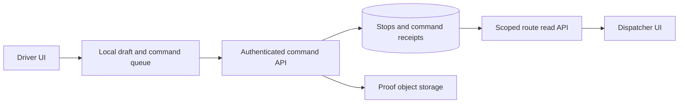

# Worked design: Design reliable delivery updates across devices and intermittent connectivity

## Start with a bounded user journey

A driver opens an assigned route, records a delivery outcome while disconnected, reconnects, and sees whether the command was accepted or needs reconciliation. The dispatcher sees accepted server state with a visible freshness indicator.

The invariant is: **One accepted delivery command changes one authorized stop once, and an older offline command cannot silently overwrite a newer accepted stop state.**

Non-goals: Do not design global route optimization, background geolocation tracking, or a full logistics marketplace. Keep proof-media upload and stop-state acceptance as related but separately recoverable operations.

Before choosing infrastructure, write three acceptance examples: an ordinary successful operation, a repeated or conflicting operation, and an unavailable dependency. Define what the user can still do in each case. A phrase such as highly available is incomplete until you name the operation and the behavior allowed when a dependency fails.

## Worked target architecture

This is the teaching design to evaluate, not a deployment inventory. [Source observations](README.md) distinguish what is present from what is proposed.

Start by preserving the current local interaction as a responsive draft surface. Add an explicit distinction between pending local intent and accepted shared state. A localStorage write cannot authorize a driver, settle conflicts across devices, or provide the shared history needed after a browser is cleared.

In the proposed service, the client sends a command identity, stop identity, expected stop revision, and desired outcome. The server derives driver/route access from trusted context, validates the outcome and proof policy, then commits the stop transition and command receipt together. The receipt lets a response-lost retry return the same accepted result. A reused command identity with a different payload is a conflict, not a second action.

An offline queue preserves the user's intent but does not promise eventual acceptance. If another actor changes the stop before reconnect, the expected revision can fail. Keep the draft and explain the conflict; do not silently replay until it overwrites newer work. Undo is a new authorized command against current state, not restoration of an entire old route snapshot.

Proof media has a separate lifecycle. Upload to a bounded, authorized location and pass a proof reference to the command. Define cleanup for uploaded-but-unattached media and behavior for an accepted outcome whose optional media becomes unavailable. A file upload and a database commit are not automatically one transaction.

## Read the diagram as a set of obligations

For each arrow, state the caller, trust context, timeout or transaction boundary, and observable outcome. Label a database write differently from a notification hint or a local draft update. A line crossing into a worker or provider is a potential failure window; it does not inherit atomicity from an earlier database transaction.

Choose one authoritative record for each decision. Derived caches and UI projections can be rebuilt only if the source of truth and reconstruction policy are clear. A read replica or cached response can be appropriate for some reads while being inappropriate for the admission decision that protects the invariant. Name that distinction before adding either component.

## First implementation slice and later growth

The first proposed slice should support the bounded journey with the existing architecture wherever possible. Include contract validation, authorization, the decisive state transition, a truthful response, and the focused regression that rejects the named failure. If the existing code already meets the behavior, the useful work is characterization and evidence rather than replacement.

Scale in response to a specific bottleneck. More stateless API instances may help request handling while leaving a hot row, connection limit, provider quota, or downstream queue unchanged. A queue can smooth a burst but cannot make sustained arrival exceed processing capacity indefinitely. A cache can reduce eligible reads but adds identity and freshness obligations.

Explain one alternative that could be correct under different requirements. Use the [decision record](05-design-decisions.md) to state the cost of your choice and the observation that would make you reconsider it. The goal is a design another engineer can challenge with a concrete failure, not the largest possible collection of boxes.
